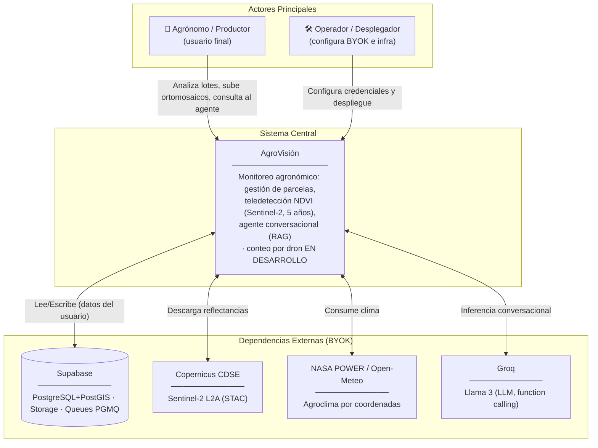
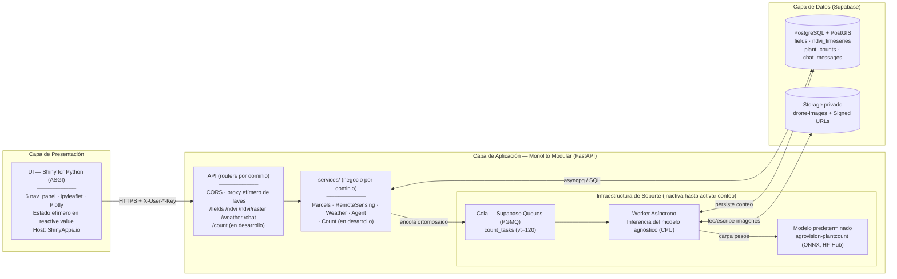
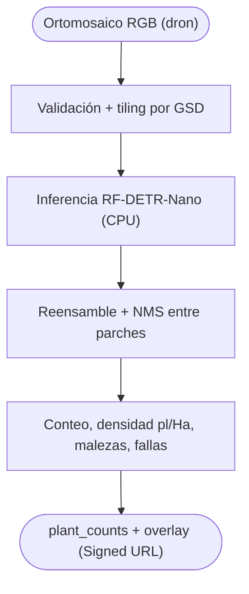
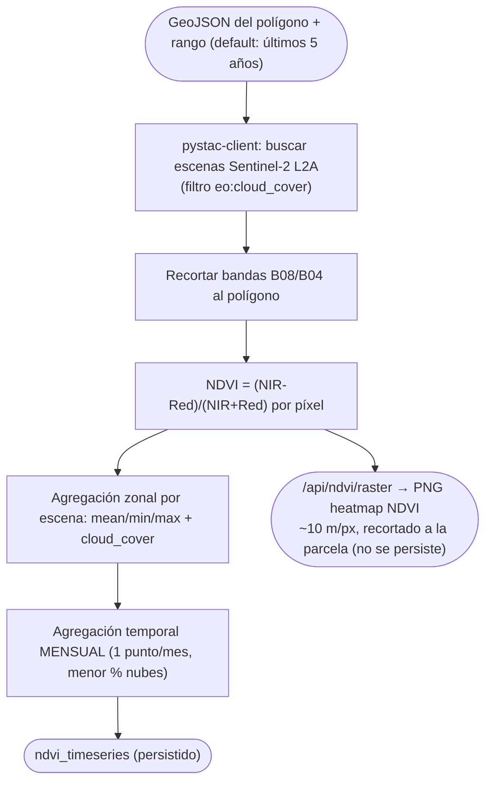
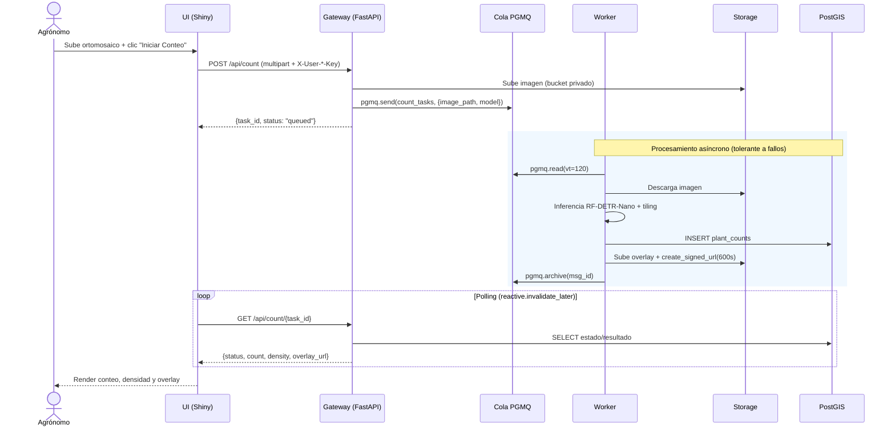
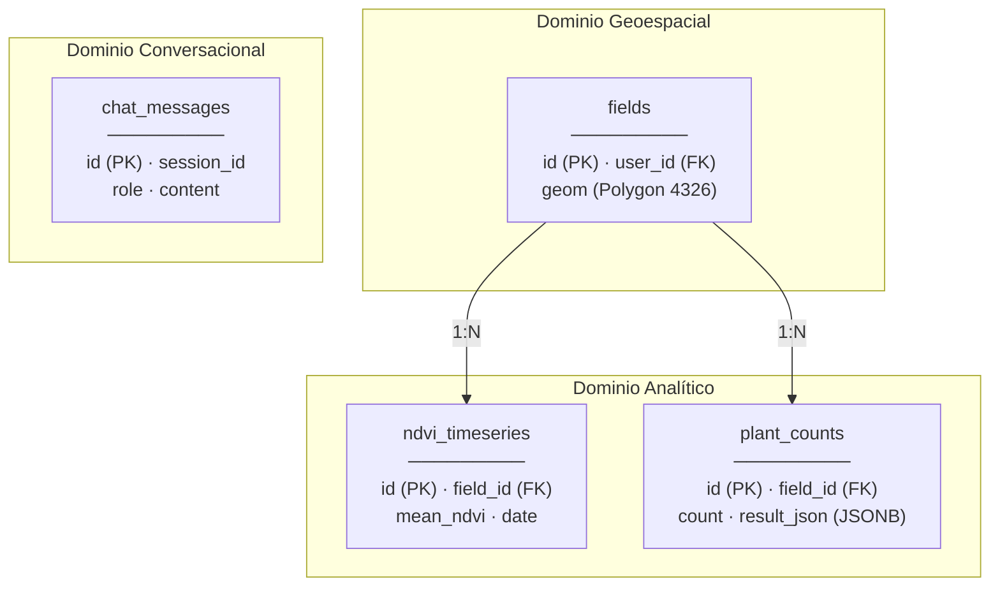
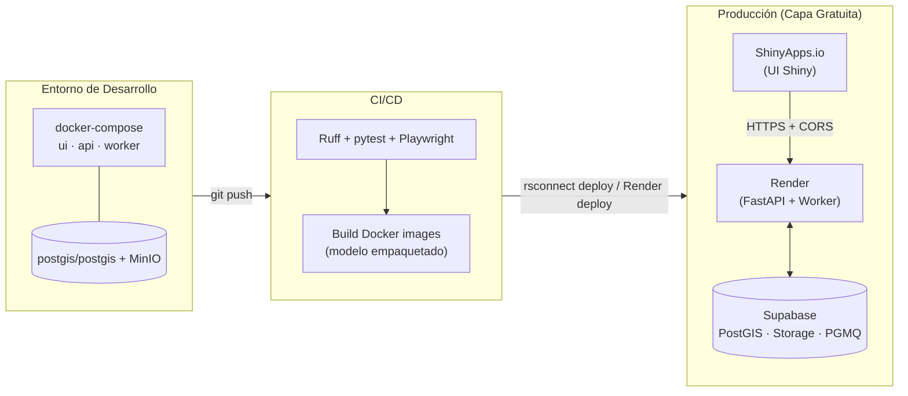

# Arquitectura — AgroVisión (Plataforma Completa)

> **Audiencia:** Arquitectos de solución, líderes técnicos, desarrolladores.
> **Alcance:** Estructura fundamental del sistema, interacciones de alto nivel (C4), esquema de datos y modelo de despliegue de la **plataforma completa** (**6 módulos**). Para especificaciones funcionales, ver [`description_proyecto_agrovision.md`](../reference/description_proyecto_agrovision.md).
>
> **Estilo arquitectónico:** **monolito modular** (un solo backend FastAPI con límites por dominio bien aislados — `api/` HTTP + `services/` negocio), **microservices-ready**: cada dominio puede extraerse a un servicio propio sin reescribir la UI. Elegido sobre microservicios reales por la realidad de la **capa gratuita** (Render free duerme a 15 min y multiplica cold-starts/CORS por servicio). Ver ADR en §7.
>
> **Módulos de UI (6):** Resumen de Campo · **Creación de Parcelas** (nuevo: dibujo del polígono) · Teledetección (solo gráficos + heatmap NDVI) · Conteo por Dron (**en desarrollo / standby**) · Asistente Agéntico · Credenciales.
>
> **Frontend (Fase 8 — Agro-Stack):** la UI migra de **Shiny** a **Astro + Tailwind** (SPA estática, hash-routing, responsive, sidebar/footer plegables) que replica el [mockup](../investigation/agrovisi_n_spa_prototype.html) y consume `/api/*` directo (Leaflet-draw para el mapa, Chart.js para NDVI/clima). El gateway **FastAPI sirve el build estático en `/`** y mantiene `/api`. **Shiny queda como _legacy_** (opcional en `/shiny`). Sigue la "Regla de Oro" de [`plan_replication.md`](../doc_guia/plan_replication.md) (una página, hash, rutas relativas, CSS inline).
>
> **Estado del Conteo:** el módulo de visión arranca **en desarrollo** (`COUNTING_ENABLED=false`); se construye **todo lo demás** ahora. La tabla `plant_counts`, la cola PGMQ y el worker se crean pero quedan inactivos hasta publicar el modelo.

---

## 1. Visión General del Sistema (C4 – Nivel Contexto)

**Decisiones arquitectónicas clave (Nivel Macro):**
- **Open-source, costo cero:** todo el stack vive en capa gratuita (ShinyApps.io + Render + Supabase + Groq + Copernicus).
- **BYOK con cero persistencia de credenciales:** las llaves del usuario se inyectan por sesión y se descartan; nunca se almacenan.
- **Servicios desacoplados:** UI (Shiny) y backend (FastAPI) se despliegan por separado y se comunican vía HTTPS + CORS.
- **Procesamiento asíncrono nativo de Postgres:** colas PGMQ embebidas en Supabase (sin Redis/RabbitMQ).

---

## 2. Componentes Internos (C4 – Nivel Contenedor)

**Flujo principal (crear parcela → teledetección), el que se construye ahora:**
1. En **Creación de Parcelas** el agrónomo dibuja el polígono (`ipyleaflet` + `DrawControl`), lo nombra y guarda: `POST /api/fields` (con cabeceras BYOK) → `RemoteSensing`/`Parcels` persisten en `fields` (Supabase del usuario).
2. Al guardar, se dispara un **backfill** (background task) que consulta los **últimos 5 años** de NDVI (Sentinel-2, **agregado mensual**) y los persiste en `ndvi_timeseries`.
3. En **Teledetección** el usuario elige la parcela; la UI pide `POST /api/ndvi` (serie persistida + fechas nuevas) y `POST /api/weather` (Open-Meteo, on-demand) y los grafica (Plotly doble eje). No se dibuja aquí.
4. Opcional: `POST /api/ndvi/raster` devuelve un PNG colorizado del **heatmap NDVI** (~10 m/px, Sentinel-2) recortado a la parcela; la UI lo pinta como `ImageOverlay` (read-only).
5. En **Resumen de Campo** los KPIs por parcela se leen de lo persistido; el **Asistente** consulta esas mismas tablas vía function calling.

**Flujo diferido (conteo por dron) — EN DESARROLLO, no se activa todavía:**
1. El agrónomo sube un ortomosaico (`ui.input_file`); la UI llama `POST /api/count` con cabeceras BYOK.
2. El gateway sube la imagen a Storage y envía un mensaje a la cola `count_tasks` (PGMQ).
3. El worker lee el mensaje (`vt=120`), carga el modelo agnóstico (`agrovision-plantcount`) y ejecuta la inferencia (con *tiling* si es grande).
4. El worker persiste el resultado en `plant_counts` y genera una **Signed URL** del overlay.
5. La UI sondea `GET /api/count/{id}` y, al estar `done`, renderiza conteo, densidad y overlay.
> Mientras `COUNTING_ENABLED=false`, la pestaña muestra "Módulo en preparación"; toda la infraestructura (cola/worker/tabla) existe pero está inactiva.

---

## 3. Lógica Core / Procesos Críticos

AgroVisión tiene tres motores internos relevantes (el de visión queda **en desarrollo**):

### 3.1 Pipeline de Visión (conteo) — EN DESARROLLO

### 3.2 Estadística Zonal NDVI (con default de 5 años y agregación mensual)

> **Default de rango:** si la petición no trae fechas, el motor usa `[hoy − 5 años, última escena disponible]`. La **agregación mensual** mantiene 5 años por debajo del límite de Supabase Free (500 MB) y produce gráficos legibles. El **backfill** se ejecuta una vez al crear la parcela (background task); luego solo se añaden meses nuevos (incremental por `UNIQUE(field_id, date)`).
>
> **Heatmap NDVI:** la rama `/api/ndvi/raster` coloriza el array NDVI de una escena y lo devuelve como imagen para `ImageOverlay`. Resolución **satelital ~10 m/px** (Sentinel-2); el detalle cm/px solo es posible con dron **multiespectral** y queda ligado al módulo de Conteo (en desarrollo).

### 3.3 Agente RAG (Function Calling)

El agente (Llama 3 vía Groq) traduce la intención en llamadas tipadas: `get_vegetation_index_trend`, `get_weather_context`, `get_field_planting_density`. Plan típico de 3 pasos: verificar caída NDVI → correlacionar con clima → sintetizar diagnóstico.

---

## 4. Flujo de Secuencia (Conteo Asíncrono)

---

## 5. Modelo de Dominio / Entidad-Relación

El detalle completo (diccionario, índices, RLS, migraciones) vive en [`docs/db/diseno_db.md`](../db/diseno_db.md). Resumen:

**Políticas de Datos:**
- **RLS por usuario:** `auth.uid() = user_id` en todas las tablas.
- **Storage privado + Signed URLs:** nunca exposición pública directa.
- **JSONB indexado (GIN):** detecciones de YOLO consultables sin esquema rígido.

---

## 6. Arquitectura de Despliegue (Infraestructura)

**Notas de despliegue:**
- La UI Shiny se despliega con `rsconnect deploy shiny` (ASGI nativo en ShinyApps.io); **no aplica** el problema de slugs SPA de Astro del plan de replicación.
- El backend en Render *duerme a los 15 min* (cold start 30–60 s); el modelo de conteo (`agrovision-plantcount`, ONNX ligero) cabe en 512 MB. El **módulo de conteo arranca en standby** (`COUNTING_ENABLED=false`) hasta que el repo del modelo publique el artefacto.
- Supabase Free **se pausa a los 7 días** sin actividad → keep-alive con cron ligero.

---

## 7. Decisiones Arquitectónicas Relevantes (ADRs Resumidos)

| Decisión Tomada | Alternativa Descartada | Razón Principal |
| :--- | :--- | :--- |
| **UI en Shiny for Python** | Streamlit (Plan Detallado) / Astro (plan de replicación) | Se requiere UI analítica en Python con estado reactivo por sesión; Shiny es ASGI nativo y despliega directo en ShinyApps.io sin el problema de enrutamiento SPA de Astro. |
| **UI y backend como servicios separados** | Monolito unificado Starlette | Aísla el cómputo pesado (visión/satélite) de la presentación; permite escalar/desplegar cada uno en su host gratuito. |
| **Colas PGMQ en Supabase** | Redis / RabbitMQ | Mensajería transaccional ACID embebida en Postgres; **cero costo** y sin infraestructura extra. |
| **Credenciales efímeras (BYOK, solo memoria)** | Persistencia en `localStorage` (mockup) o servidor | Elimina todo vector de fuga de secretos; refrescar borra todo (requisito del usuario). |
| **Modelo agnóstico (multi-candidato) desde repo separado, en HF Hub; AGPL-3.0 aceptada** | Entrenar dentro de AgroVisión / fijar un solo modelo | Desacopla el ML de la app; **AGPL-3.0 aceptada** (AgroVisión open-source) habilita **YOLO26**; la app descarga `agrovision-plantcount` y lo infiere vía **adaptador** (onnxruntime o `ultralytics` según la arquitectura). El **módulo de conteo arranca en standby** hasta la publicación del modelo. |
| **PostgreSQL + PostGIS** | NoSQL documental | El dominio es geoespacial y relacional (joins del agente, integridad referencial); JSONB cubre la parte flexible. |
| **Hosting gratuito (ShinyApps.io+Render+Supabase)** | Cloud administrado de pago (AWS/GCP) | Objetivo de costo cero y reproducibilidad; se asumen *caveats* (cold start, pausa, horas activas). |
| **Monolito modular (un FastAPI, `api/` + `services/`), microservices-ready** | Microservicios reales (un servicio por dominio) | En Render free cada servicio extra duerme a 15 min, suma cold-starts y complica CORS/operación. Un solo proceso con límites por dominio da la misma separación lógica ("cada uno específico") y se puede dividir luego sin tocar la UI. |
| **Creación de Parcelas como módulo propio (separado de Teledetección)** | Dibujar el polígono dentro de Teledetección (diseño previo, 5 módulos) | Separa responsabilidades: *delimitar* (escribe `fields`) vs *analizar* (solo lee/grafica). Teledetección queda read-only y enfocada en gráficos + heatmap. Pasa la UI a **6 módulos**. |
| **NDVI por defecto a 5 años con agregación mensual** | Rango corto fijo / sin agregación (todas las escenas) | Da histórico útil para "Resumen de campo" y el agente, y mantiene el volumen bajo el límite de Supabase Free; el backfill incremental evita recalcular. |
| **Heatmap NDVI satelital (~10 m/px) on-demand, sin persistir** | Persistir rásters NDVI / heatmap cm/px desde RGB | El ráster es pesado y efímero (se regenera); cm/px exige dron multiespectral (NIR), no disponible con RGB → se difiere con el módulo de Conteo. |
| **Conteo por dron arranca EN DESARROLLO (toda la infra creada, inactiva)** | Bloquear la plataforma hasta tener el modelo | Permite entregar parcelas/teledetección/agente ya; la cola/worker/tabla existen para activarse con solo `COUNTING_ENABLED=true` cuando el repo del modelo publique el artefacto. |
| **(Fase 8) UI migra a Astro + Tailwind (Agro-Stack); Shiny → legacy** | Mantener Shiny como UI principal / shell híbrido con iframe | La UI Shiny por defecto se ve básica; el objetivo es replicar el mockup (estética, **responsive**, plegables). Astro+Tailwind+JS (Leaflet/Chart.js) consumiendo `/api` da control total del look y deploy estático. **Revisa el ADR previo** ("Shiny sobre Astro"): el problema de enrutamiento SPA se mitiga con la **Regla de Oro** (una página, hash-routing, rutas relativas, CSS inline). Shiny se conserva como *legacy* (`/shiny`) por si se requiere reactividad Python. |
