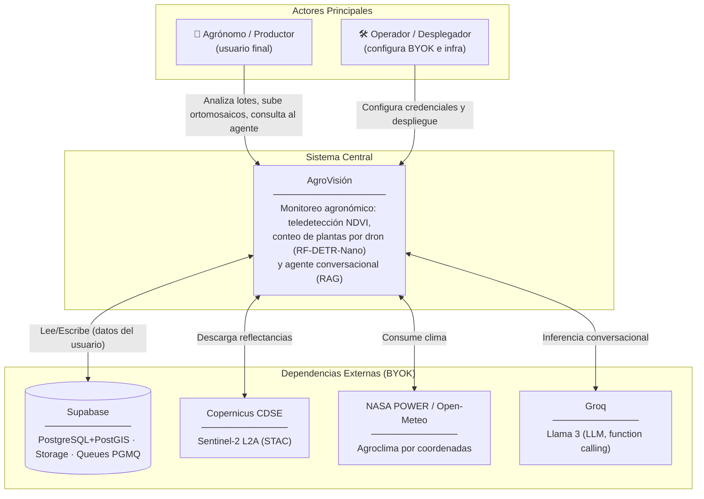
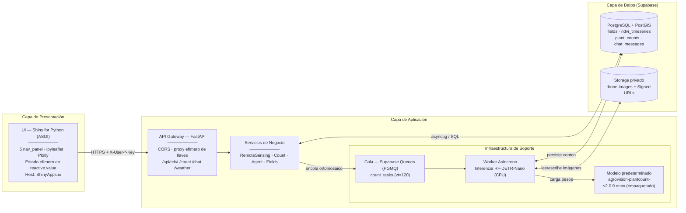
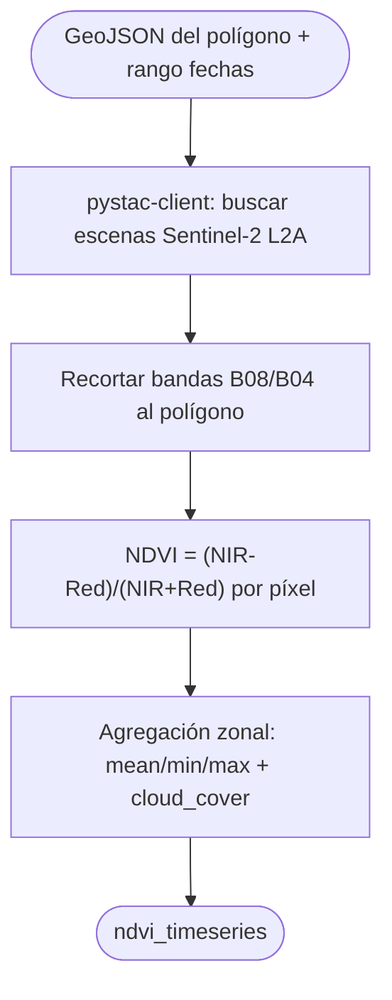
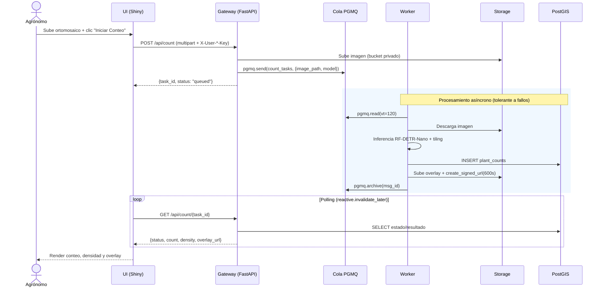
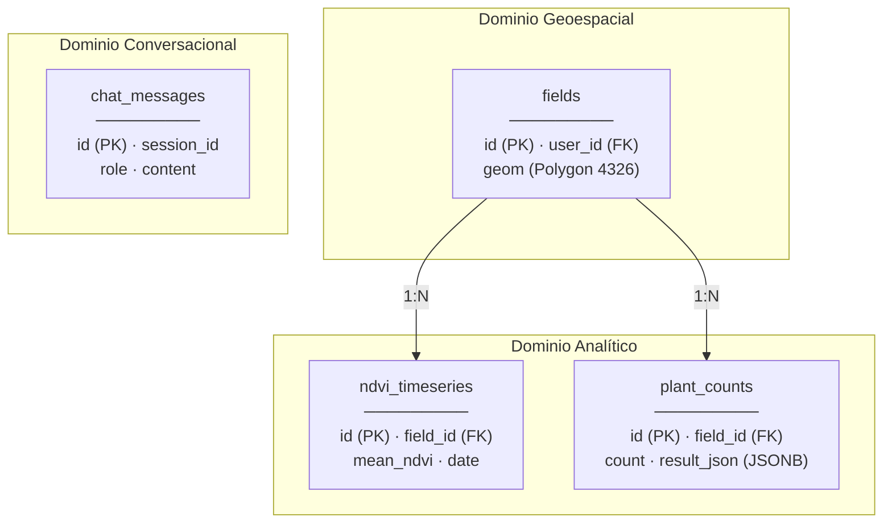
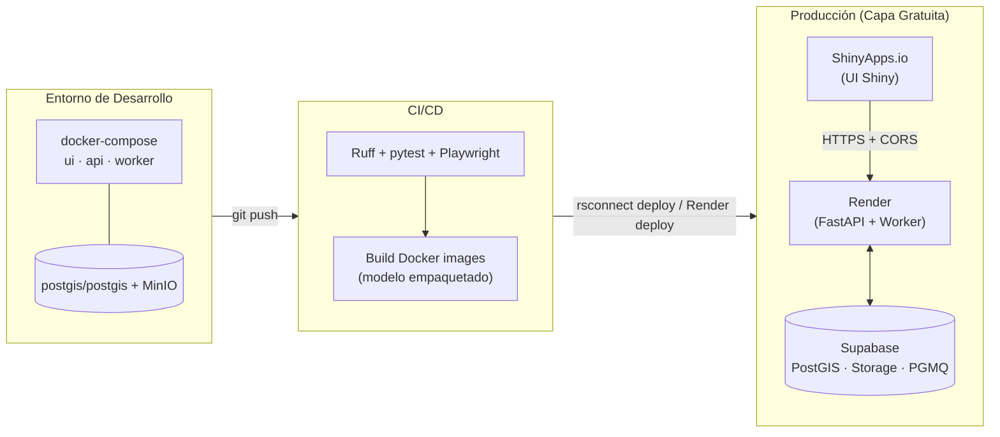

# Arquitectura — AgroVisión (Plataforma Completa)

> **Audiencia:** Arquitectos de solución, líderes técnicos, desarrolladores.
> **Alcance:** Estructura fundamental del sistema, interacciones de alto nivel (C4), esquema de datos y modelo de despliegue de la **plataforma completa** (5 módulos). Para especificaciones funcionales, ver [`description_proyecto_agrovision.md`](../reference/description_proyecto_agrovision.md). Para el alcance reducido, ver [`architecture_agrovision_mvp.md`](architecture_agrovision_mvp.md).

---

## 1. Visión General del Sistema (C4 – Nivel Contexto)

**Decisiones arquitectónicas clave (Nivel Macro):**
- **Open-source, costo cero:** todo el stack vive en capa gratuita (ShinyApps.io + Render + Supabase + Groq + Copernicus).
- **BYOK con cero persistencia de credenciales:** las llaves del usuario se inyectan por sesión y se descartan; nunca se almacenan.
- **Servicios desacoplados:** UI (Shiny) y backend (FastAPI) se despliegan por separado y se comunican vía HTTPS + CORS.
- **Procesamiento asíncrono nativo de Postgres:** colas PGMQ embebidas en Supabase (sin Redis/RabbitMQ).

---

## 2. Componentes Internos (C4 – Nivel Contenedor)

**Flujo de una interacción típica (conteo por dron):**
1. El agrónomo sube un ortomosaico en la UI (`ui.input_file`); la UI llama `POST /api/count` con las cabeceras BYOK.
2. El gateway sube la imagen a Storage y envía un mensaje a la cola `count_tasks` (PGMQ).
3. El worker lee el mensaje (`vt=120`), carga RF-DETR-Nano y ejecuta la inferencia (con *tiling* si es grande).
4. El worker persiste el resultado en `plant_counts` y genera una **Signed URL** del overlay.
5. La UI sondea `GET /api/count/{id}` y, al estar `done`, renderiza conteo, densidad y overlay.

---

## 3. Lógica Core / Procesos Críticos

AgroVisión tiene tres motores internos relevantes:

### 3.1 Pipeline de Visión (conteo)

### 3.2 Estadística Zonal NDVI

### 3.3 Agente RAG (Function Calling)

El agente (Llama 3 vía Groq) traduce la intención en llamadas tipadas: `get_vegetation_index_trend`, `get_weather_context`, `get_field_planting_density`. Plan típico de 3 pasos: verificar caída NDVI → correlacionar con clima → sintetizar diagnóstico.

---

## 4. Flujo de Secuencia (Conteo Asíncrono)

---

## 5. Modelo de Dominio / Entidad-Relación

El detalle completo (diccionario, índices, RLS, migraciones) vive en [`docs/db/diseno_db.md`](../db/diseno_db.md). Resumen:

**Políticas de Datos:**
- **RLS por usuario:** `auth.uid() = user_id` en todas las tablas.
- **Storage privado + Signed URLs:** nunca exposición pública directa.
- **JSONB indexado (GIN):** detecciones de YOLO consultables sin esquema rígido.

---

## 6. Arquitectura de Despliegue (Infraestructura)

**Notas de despliegue:**
- La UI Shiny se despliega con `rsconnect deploy shiny` (ASGI nativo en ShinyApps.io); **no aplica** el problema de slugs SPA de Astro del plan de replicación.
- El backend en Render *duerme a los 15 min* (cold start 30–60 s); el modelo de conteo (`agrovision-plantcount`, ONNX ligero) cabe en 512 MB. El **módulo de conteo arranca en standby** (`COUNTING_ENABLED=false`) hasta que el repo del modelo publique el artefacto.
- Supabase Free **se pausa a los 7 días** sin actividad → keep-alive con cron ligero.

---

## 7. Decisiones Arquitectónicas Relevantes (ADRs Resumidos)

| Decisión Tomada | Alternativa Descartada | Razón Principal |
| :--- | :--- | :--- |
| **UI en Shiny for Python** | Streamlit (Plan Detallado) / Astro (plan de replicación) | Se requiere UI analítica en Python con estado reactivo por sesión; Shiny es ASGI nativo y despliega directo en ShinyApps.io sin el problema de enrutamiento SPA de Astro. |
| **UI y backend como servicios separados** | Monolito unificado Starlette | Aísla el cómputo pesado (visión/satélite) de la presentación; permite escalar/desplegar cada uno en su host gratuito. |
| **Colas PGMQ en Supabase** | Redis / RabbitMQ | Mensajería transaccional ACID embebida en Postgres; **cero costo** y sin infraestructura extra. |
| **Credenciales efímeras (BYOK, solo memoria)** | Persistencia en `localStorage` (mockup) o servidor | Elimina todo vector de fuga de secretos; refrescar borra todo (requisito del usuario). |
| **Modelo agnóstico (multi-candidato) desde repo separado, en HF Hub; AGPL-3.0 aceptada** | Entrenar dentro de AgroVisión / fijar un solo modelo | Desacopla el ML de la app; **AGPL-3.0 aceptada** (AgroVisión open-source) habilita **YOLO26**; la app descarga `agrovision-plantcount` y lo infiere vía **adaptador** (onnxruntime o `ultralytics` según la arquitectura). El **módulo de conteo arranca en standby** hasta la publicación del modelo. |
| **PostgreSQL + PostGIS** | NoSQL documental | El dominio es geoespacial y relacional (joins del agente, integridad referencial); JSONB cubre la parte flexible. |
| **Hosting gratuito (ShinyApps.io+Render+Supabase)** | Cloud administrado de pago (AWS/GCP) | Objetivo de costo cero y reproducibilidad; se asumen *caveats* (cold start, pausa, horas activas). |
