# Arquitectura — AgroVisión (Plataforma Completa)

> **Audiencia:** Arquitectos de solución, líderes técnicos, desarrolladores.
> **Alcance:** Estructura fundamental del sistema, interacciones de alto nivel (C4), esquema de datos y modelo de despliegue de la **plataforma completa** (**8 módulos UI**). Para especificaciones funcionales, ver [`description_proyecto_agrovision.md`](../reference/description_proyecto_agrovision.md).
>
> **Estilo arquitectónico:** **monolito modular** (un solo backend FastAPI con límites por dominio bien aislados — `api/` HTTP + `services/` negocio), **microservices-ready**: cada dominio puede extraerse a un servicio propio sin reescribir la UI. Elegido sobre microservicios reales por la realidad de la **capa gratuita** (cada servicio extra duplica cold-starts y complica CORS/operación). Ver ADR en §7.
>
> **Módulos de UI (8):** Resumen de Campo · Creación de Parcelas · Teledetección (GIS) · Conteo por Dron (**standby**) · Asistente Agéntico · Credenciales · Explorador de Datos · Visor de Telemetría.
>
> **Frontend (Astro — Fase 8, consolidado en Fase 10):** la UI es **Astro + Tailwind** (SPA estática, hash-routing, responsive, sidebar/footer plegables) que replica el [mockup](../investigation/agrovisi_n_spa_prototype.html) y consume `/api/*` directo (Leaflet-draw para el mapa, Chart.js para NDVI/clima). El gateway **FastAPI sirve el build estático en `/`** y mantiene `/api`. **Shiny fue eliminado por completo en la Fase 10**. Sigue la "Regla de Oro" de [`plan_replication.md`](../doc_guia/plan_replication.md) (una página, hash, rutas relativas, CSS inline).
>
> **Despliegue (Fase 10):** un **único contenedor Docker en Hugging Face Spaces** (SDK Docker) construido desde el `Dockerfile` de la raíz; el gateway sirve UI + API en el mismo origen. Alternativa: Render (Docker).
>
> **Actualizaciones:** Este documento se actualiza tras **cada cambio sustancial** en el proyecto (nuevos módulos, tablas, endpoints, servicios externos, cambios de despliegue). Ver [`AGENTS.md`](../../AGENTS.md) §Conventions.

---

## 1. Visión General del Sistema (C4 — Nivel Contexto)

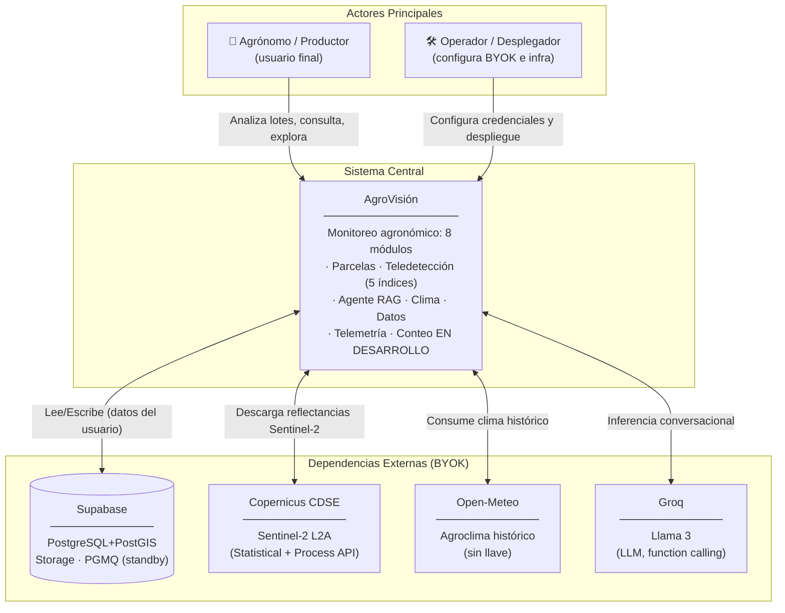

**Decisiones arquitectónicas clave (Nivel Macro):**
- **Open-source, costo cero:** todo el stack vive en capa gratuita (Hugging Face Spaces + Supabase + Groq + Copernicus + Open-Meteo).
- **BYOK con cero persistencia:** las llaves del usuario se inyectan por sesión y se descartan; nunca se almacenan.
- **Servicio único (gateway):** un solo FastAPI sirve la UI Astro estática en `/` y la API en `/api` (mismo origen).
- **Procesamiento asíncrono nativo de Postgres:** colas PGMQ embebidas en Supabase (standby, con el Conteo).

---

## 2. Componentes Internos (C4 — Nivel Contenedor)

### 2.1 Vista General

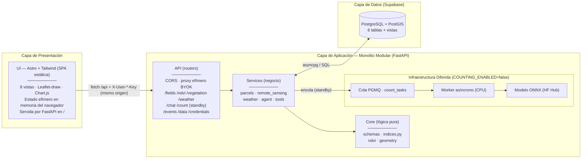

### 2.2 Por Módulo (UI)

#### 2.2.1 Resumen de Campo
- **Rol:** KPIs rápidos de la parcela seleccionada (NDVI último, tendencia, área)
- **Endpoint:** `POST /api/ndvi` (serie completa, toma último valor)
- **UI:** Chart.js línea simple + cards informativas
- **Datos:** `vegetation_indices` (índices espectrales) + `fields`

#### 2.2.2 Creación de Parcelas
- **Rol:** Dibujar polígono en Leaflet-draw, nombrarlo y persistirlo. Dispara backfill automático.
- **Endpoints:** `GET /api/fields` · `POST /api/fields` · `DELETE /api/fields/{id}`
- **UI:** Leaflet con DrawControl, formulario de nombre, lista de parcelas
- **Backend:** `services/parcels.py` — valida geometría, persiste, lanza backfill en background
- **Datos:** Escribe en `fields`; dispara backfill → `vegetation_indices`

#### 2.2.3 Teledetección (GIS)
- **Rol:** Visualización de los 5 índices espectrales (NDVI/EVI/SAVI/NDWI/NDRE) vs clima. Heatmap generable.
- **Endpoints:** `POST /api/vegetation/{index}` · `POST /api/vegetation/{index}/raster` · `POST /api/vegetation/reprocess` (SF13.5) · `POST /api/weather`
- **UI:** Selector de índice, Chart.js doble eje (índice + clima), botón heatmap, botón reprocesar
- **Backend:** `services/remote_sensing.py` (Copernicus CDSE, Sentinel Hub Statistical + Process API)
- **Datos:** Lee `vegetation_indices`; escribe mediante reprocess o backfill

#### 2.2.4 Conteo por Dron (en desarrollo / standby)
- **Rol:** Subir ortomosaico → worker asíncrono infiere conteo vía modelo ONNX → Signed URL del overlay
- **Estado:** `COUNTING_ENABLED=false` — toda la infraestructura (tabla, cola, worker) existe pero inactiva
- **Endpoints:** `POST /api/count` · `GET /api/count/{id}` (responden 503 en standby)

#### 2.2.5 Asistente Agéntico (RAG)
- **Rol:** Chat conversacional con Groq/Llama 3 y 3 herramientas tipadas (tendencia NDVI, clima, densidad)
- **Endpoints:** `POST /api/chat`
- **UI:** Historial de chat con tool_logs, input + botón enviar
- **Backend:** `services/agent.py` (orquestación tool-calling) + `services/tools.py` (3 herramientas)
- **Datos:** `chat_messages` (memoria conversacional)

#### 2.2.6 Credenciales
- **Rol:** Capturar llaves BYOK del usuario (Groq, Copernicus, Supabase) y nunca persistirlas
- **Endpoints:** `GET /api/credentials/status`
- **UI:** Formularios `input[type=password]`, botón "Usar en esta sesión"
- **Backend:** `api/deps.py` — extrae cabeceras `X-User-*` por request; en desarrollo fallback a `DEV_*` env vars

#### 2.2.7 Explorador de Datos (Fase 11)
- **Rol:** Consultar tablas de Supabase directamente y ejecutar SQL personalizado (SELECT only). Incluye diagrama ER interactivo.
- **Endpoints:** `GET /api/data/{table}` · `POST /api/data/query` · `GET /api/data/schema` (esquema para ER)
- **UI:** Selector de tabla + vista de registros + textarea SQL + diagrama ER (Mermaid JS desde data/schema)

#### 2.2.8 Visor de Telemetría (Fase 12)
- **Rol:** Botón + modal que muestra todos los eventos de UI y backend (acción, timestamp, meta)
- **Endpoints:** `GET /api/events/recent` (buffer) · `GET /api/events/all` (BD, opcional)
- **UI:** Modal con lista de eventos, status dinámico (verde/ámbar/rojo)
- **Backend:** `api/events.py` — ingest, buffer, `emit()` para eventos backend

---

## 3. Lógica Core / Procesos Críticos

### 3.1 Vista General

AgroVisión tiene 5 procesos core (el de visión diferido):

| Proceso | Módulo | Trigger | Persistencia |
|---------|--------|---------|--------------|
| Backfill NDVI al crear parcela | Parcelas | `POST /api/fields` | `vegetation_indices` |
| Serie mensual de índice espectral | Teledetección | `POST /api/vegetation/{index}` | `vegetation_indices` (cache) |
| Heatmap de índice | Teledetección | `POST /api/vegetation/{index}/raster` | No persiste (PNG en memoria) |
| Serie climática mensual | Clima | `POST /api/weather` | No persiste (on-demand) |
| Reprocesar índices + clima | Teledetección | `POST /api/vegetation/reprocess` | `vegetation_indices` (sobrescribe) |
| Agente conversacional | Chat | `POST /api/chat` | `chat_messages` (memoria) |
| Conteo por dron (standby) | Conteo | Subir ortomosaico | `plant_counts` + Storage |

### 3.2 Pipeline de Teledetección (Índices Espectrales)

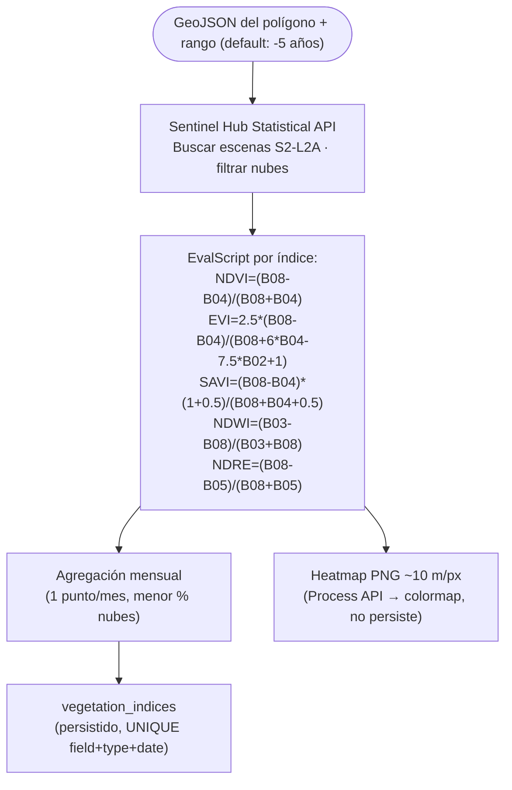

**Detalles clave:**
- **5 índices:** NDVI (salud general), EVI (corrige aerosoles), SAVI (suelo desnudo), NDWI (agua), NDRE (clorofila)
- **Backend:** `backend/core/indices.py` (fórmulas vectorizadas seguras ante /0) + `backend/services/remote_sensing.py` (evalscripts genéricos via `_INDEX_CONFIG`)
- **API externa:** Copernicus CDSE (Sentinel Hub, Statistical API para series, Process API para heatmaps)
- **Reproceso:** `POST /api/vegetation/reprocess` recalcula los 5 índices y sobrescribe en `vegetation_indices`

### 3.3 Pipeline de Clima (Open-Meteo)

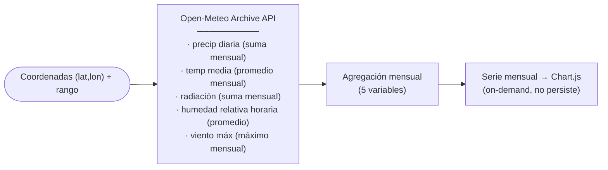

**Variables climáticas:** `precip_mm`, `temp_mean_c`, `radiation`, `humidity_mean`, `wind_max`

### 3.4 Backfill al Crear Parcela

```
POST /api/fields → create_parcel() → run_ndvi_backfill (BackgroundTask)
                                        ↓
                              index_series_monthly(geojson, index="ndvi")
                                        ↓
                              Sentinal Hub Statistical API (5 años)
                                        ↓
                              upsert_index_points → vegetation_indices
```

- Disparado **una sola vez** al crear la parcela
- Idempotente: `UNIQUE(field_id, index_type, date)` evita duplicados
- Si faltan credenciales Copernicus, se omite silenciosamente

### 3.5 Agente RAG (Function Calling)

```
POST /api/chat → history + message + TOOLS_SCHEMA → Groq (Llama 3)
                                                       ↓
                                              ¿tool_calls? ─sí→ ejecutar herramienta → resultado → Groq
                                                       | no
                                                       ↓
                                              reply + tool_logs → chat_messages
```

**Herramientas:**
1. `get_vegetation_index_trend(field_name, start, end)` — tendencia de cualquier índice
2. `get_weather_context(lat, lon, start, end)` — resumen climático mensual
3. `get_field_planting_density(field_name)` — densidad plantas/ha (en desarrollo, depende del Conteo)

### 3.6 Reprocesamiento de Datos (SF13.5)

```
POST /api/vegetation/reprocess {field_id, mode}
                    │
          ┌─────────┼─────────┐
          │         │         │
      "indices"  "weather"  "all"
          │         │         │
          ▼         ▼         ▼
  for each index:   ─   for each index:
   Copernicus API    │    Copernicus API
   → upsert_index    │    → upsert_index
                     │
                     └─── weather: flag True
```

- **Modos:** `indices` (solo Sentinel-2), `weather` (recarga clima), `all` (ambos)
- **Uso típico:** parcelas legacy (ej. Camposol) creadas antes de Fase 13 que solo tienen NDVI
- **Eventos:** emite `reprocess_done` con resumen de puntos por índice

---

## 4. Flujo de Secuencia

### 4.1 Crear Parcela + Backfill

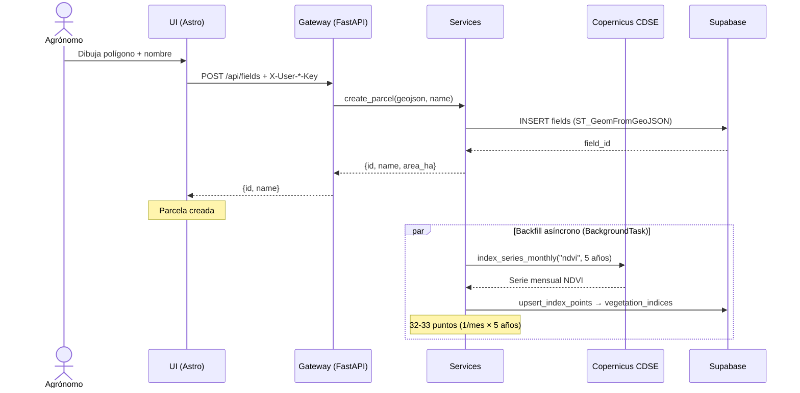

### 4.2 Consultar Teledetección + Clima

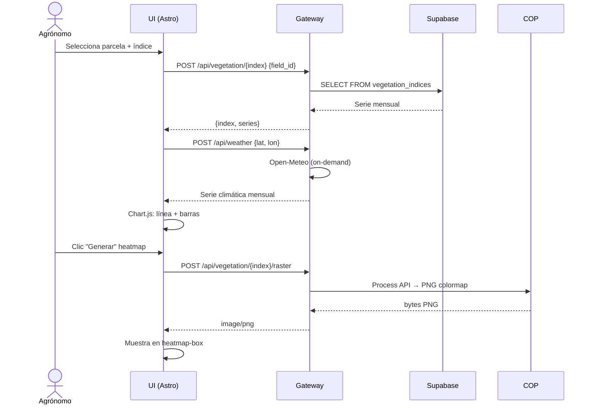

### 4.3 Reprocesar Datos (SF13.5)

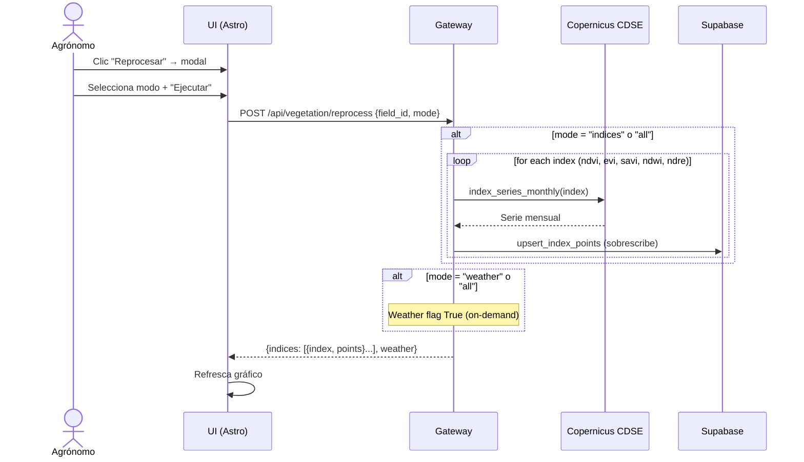

### 4.4 Chat con Agente RAG

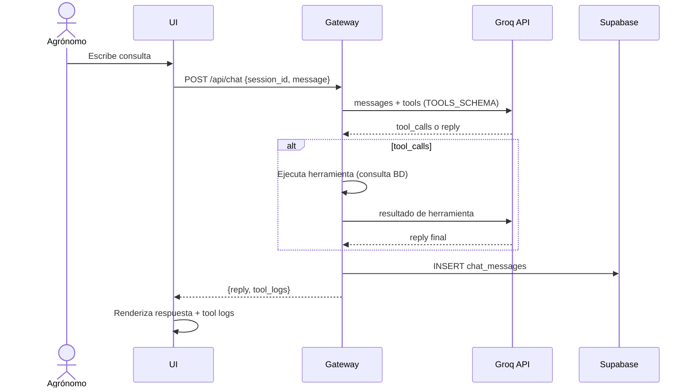

### 4.5 Configurar Credenciales BYOK

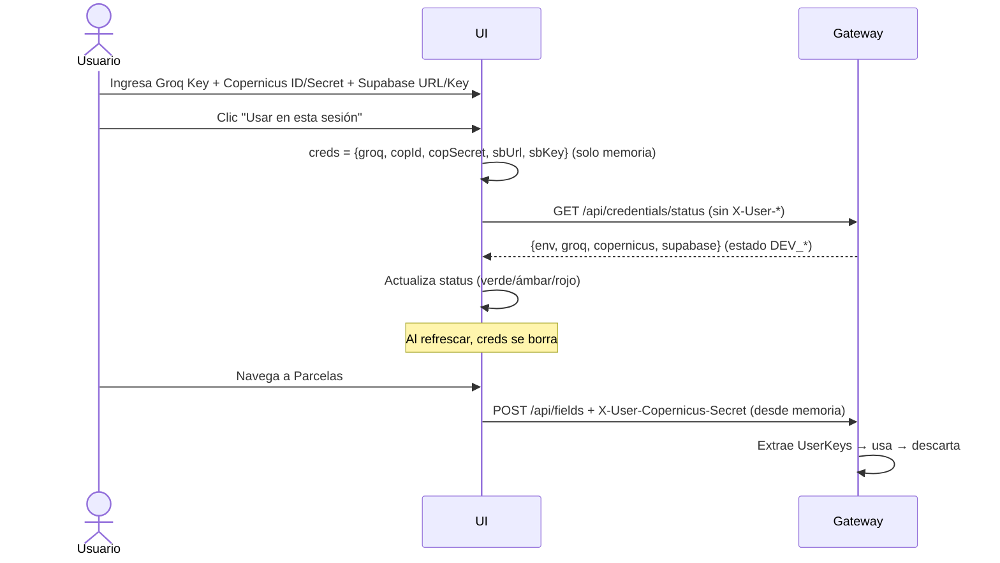

### 4.6 Conteo por Dron (Diferido — Standby)

> `COUNTING_ENABLED=false` — infraestructura creada pero inactiva. Diagrama de referencia para cuando se active.

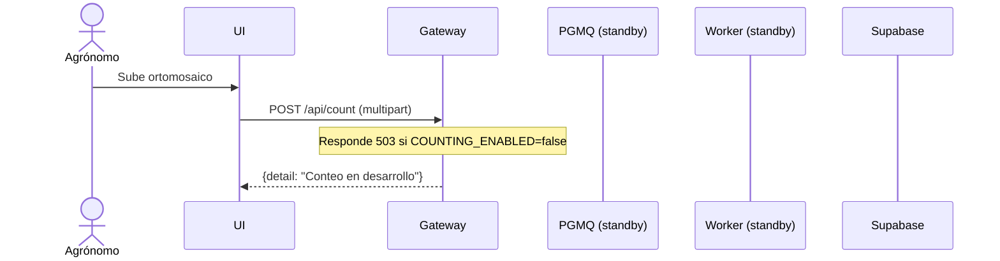

---

## 5. Modelo de Datos (ER Diagram)

### 5.1 Diagrama Entidad-Relación

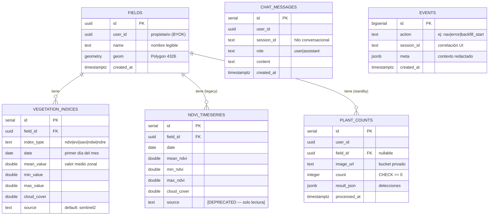

### 5.2 Descripción de Tablas

| Tabla | Propósito | Creada en | Registros típicos |
|-------|-----------|-----------|-------------------|
| `fields` | Parcelas agrícolas con geometría (Polygon 4326) | `0001_init.sql` | 1–50 por espacio |
| `vegetation_indices` | Serie mensual de los 5 índices espectrales (NDVI/EVI/SAVI/NDWI/NDRE) | `0004_indices.sql` (Fase 13) | ~33 pts/mes × 5 índices = ~165 por parcela |
| `ndvi_timeseries` | **[DEPRECATED]** Solo NDVI legacy. Datos migrados a `vegetation_indices` vía `0005_migrate_ndvi_legacy.sql`. Solo lectura. | `0001_init.sql` | ~33 por parcela (migrados) |
| `plant_counts` | Resultados de conteo por dron (standby, sin escrituras) | `0001_init.sql` | 0 (inactiva) |
| `chat_messages` | Memoria conversacional del agente RAG | `0001_init.sql` | Variable por sesión |
| `events` | Telemetría de UI/backend (opcional, si `EVENTS_PERSIST=true`) | `0003_events.sql` (Fase 9) | ~500 últimos en buffer |

### 5.3 Constraints y Relaciones Clave

- **`vegetation_indices`**: `UNIQUE(field_id, index_type, date)` — un valor por parcela/índice/mes
- **`ndvi_timeseries`**: `UNIQUE(field_id, date)` — [DEPRECATED] solo lectura
- **`fields.geom`**: índice GIST (`fields_geom_gist_idx`) para acelerar búsquedas espaciales
- **`chat_messages`**: índice compuesto `(session_id, created_at)` para historial rápido
- **`events`**: índice compuesto `(session_id, created_at)` para trazabilidad de sesión

### 5.4 Estrategia de Persistencia

| Dato | Persistencia | Estrategia |
|------|-------------|------------|
| Parcelas | `fields` | INSERT/UPDATE/DELETE vía repositorios |
| Índices espectrales | `vegetation_indices` | Upsert idempotente (ON CONFLICT DO UPDATE) |
| NDVI legacy | `ndvi_timeseries` | **[DEPRECATED]** Solo lectura; escrituras congeladas |
| Clima | No persiste | On-demand desde Open-Meteo, agregación mensual en memoria |
| Chat | `chat_messages` | INSERT al finalizar turno |
| Telemetría | Buffer (`deque`) + opcional `events` | Buffer en memoria (500 máx); persistencia best-effort si `EVENTS_PERSIST=true` |
| Conteo | `plant_counts` + Storage | Standby sin escrituras |

---

## 6. Arquitectura de Despliegue (Infraestructura)

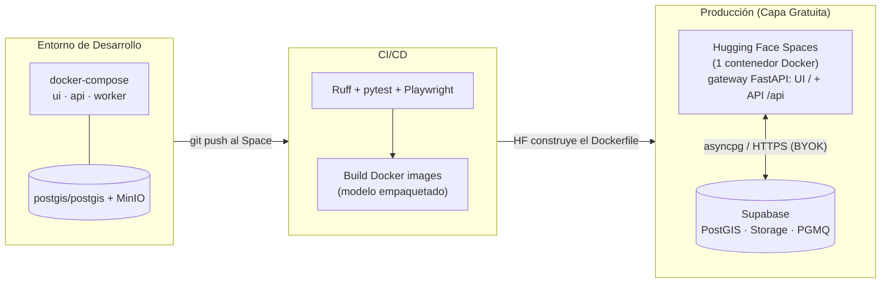

**Notas de despliegue:**
- **Un solo servicio**: el `Dockerfile` de la raíz compila Astro (Node) y corre el gateway FastAPI que sirve UI + API en el mismo origen. Se publica con `git push` al repo del Space (`scripts/deploy_hf.ps1`); HF construye la imagen. Corre como **usuario no-root (1000)**.
- HF Spaces CPU básica da **16 GB RAM** (holgado para las deps); el Space **se duerme a las 48 h** sin uso (cold start 30–60 s). El **módulo de conteo arranca en standby** (`COUNTING_ENABLED=false`).
- **Alternativa: Render** (Docker, el mismo `Dockerfile` raíz + `render.yaml`); duerme a 15 min, 512 MB.
- Supabase Free **se pausa a los 7 días** sin actividad → keep-alive con cron ligero.

---

## 7. Decisiones Arquitectónicas Relevantes (ADRs Resumidos)

| Decisión Tomada | Alternativa Descartada | Razón Principal |
| :--- | :--- | :--- |
| **UI en Astro + Tailwind (SPA estática)** | Shiny for Python / Streamlit | Replicar mockup con control total del look; deploy como estático servido por FastAPI. Shiny eliminado en Fase 10. |
| **Monolito modular (un FastAPI, api/ + services/), microservices-ready** | Microservicios reales | En capa gratuita cada servicio extra duerme/cold-start; un solo proceso con límites por dominio es más simple. |
| **Colas PGMQ en Supabase** | Redis / RabbitMQ | Mensajería transaccional ACID embebida en Postgres; **cero costo** y sin infraestructura extra. |
| **Credenciales efímeras (BYOK, solo memoria)** | Persistencia en localStorage o servidor | Elimina todo vector de fuga de secretos; refrescar borra todo. |
| **5 índices espectrales en tabla genérica (vegetation_indices)** | Tabla separada por índice | Una sola tabla con `index_type` discrimina; misma estructura, un solo upsert genérico. |
| **Migración NDVI legacy a vegetation_indices** | Mantener ndvi_timeseries con fallback | Datos históricos copiados a vegetation_indices (migración 0005); ndvi_timeseries declarado deprecated, sin fallback. |
| **Reproceso vía endpoint dedicado (SF13.5)** | Solo backfill al crear parcela | Parcelas legacy necesitan recalcular índices nuevos; endpoint permite reproceso manual o por script. |
| **Telemetría en buffer + tabla opcional** | Solo persistencia | Buffer en memoria es instantáneo y suficiente para depuración; BD opcional para trazabilidad larga. |

---

## 8. Seguridad — Modelo de Amenazas y Mitigaciones (Fase 10)

La nueva arquitectura es **un servicio público de un solo origen** (gateway en HF Spaces) bajo **BYOK**. Eso simplifica el modelo: **el servidor no guarda secretos de datos** (los pone cada usuario por sesión), así que un atacante no obtiene credenciales aunque comprometa la instancia.

### 8.1 Superficie de ataque y mitigaciones

| Amenaza | Riesgo | Mitigación (estado) |
| :--- | :--- | :--- |
| **DDoS / flood de la API** | Saturar la única instancia o agotar cuotas de APIs externas (BYOK) | **Rate limiting** en `/api` por IP (ventana deslizante en memoria, `RATE_LIMIT_PER_MIN`, 429 + `Retry-After`) ✅. Borde del host (HF) aporta protección de red volumétrica. |
| **Abuso del ingest de telemetría** (`POST /api/events`) | Spam de eventos | Buffer **acotado** (`deque(maxlen=500)`) ✅; persistencia **off por defecto** (`EVENTS_PERSIST=false`) ✅; cubierto por rate limiting ✅. |
| **Fuga de secretos** | Exponer llaves BYOK | Nunca se persisten; viajan en cabeceras `X-User-*` y se descartan ✅. La telemetría **redacta** claves sensibles ✅. No se loguean cabeceras ✅. `.env` fuera del bundle (`.gitignore`) ✅. |
| **SSRF** (URLs de datos controladas por el usuario) | Forzar al server a conectar a hosts internos | El usuario solo apunta a **su propia** BD; conviene validar esquema/host de Supabase URL (📋 pendiente: allowlist de hosts). |
| **Inyección de prompt** (agente RAG) | Manipular al LLM | El agente solo expone **3 herramientas tipadas de solo-lectura**; no ejecuta acciones destructivas ✅. |
| **Agotamiento de recursos** (polígonos enormes, heatmap) | OOM/CPU | `resx/resy` fijos y rango acotado en NDVI ✅; `MAX_UPLOAD_MB` en subidas ✅. |
| **Clickjacking / MIME sniffing / XSS heredado** | Embeber la app, sniffing | Cabeceras `X-Frame-Options: SAMEORIGIN`, `X-Content-Type-Options: nosniff`, `Referrer-Policy` ✅. |
| **CORS demasiado abierto** | Peticiones cross-site con credenciales | UI y API son **mismo origen** en HF (no requiere CORS). `ALLOWED_ORIGINS` se restringe por entorno ✅. |
| **Contenedor con privilegios** | Escalada si hay RCE | La imagen corre como **usuario no-root (1000)** ✅. |

### 8.2 Defensa en profundidad (capas)

1. **Borde del host (HF Spaces):** TLS y protección de red base.
2. **Gateway:** rate limiting + cabeceras de hardening + tamaños de subida acotados.
3. **Datos (Supabase):** RLS por usuario (efectiva si se adopta Auth multiusuario), Storage privado + Signed URLs.
4. **BYOK:** sin secretos en el server → el impacto de un compromiso es mínimo.
