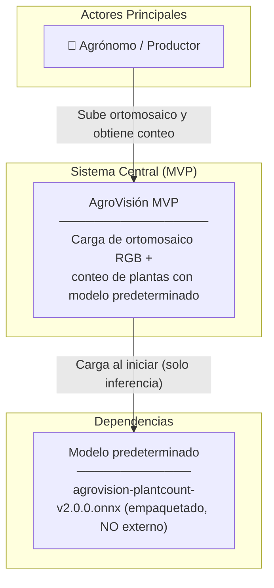
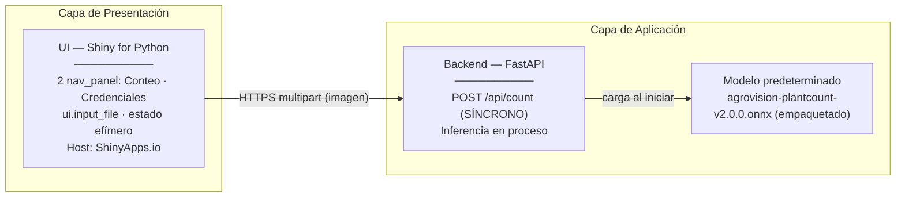
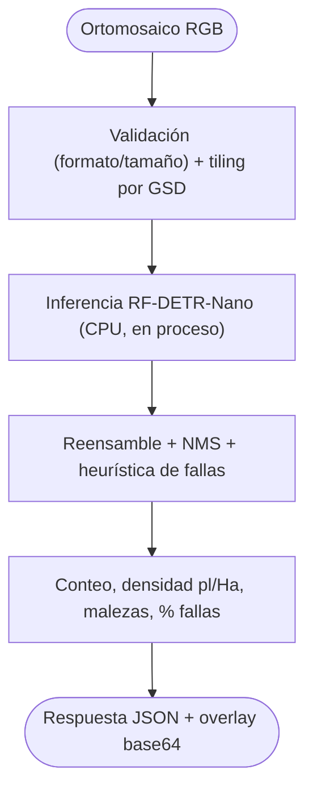
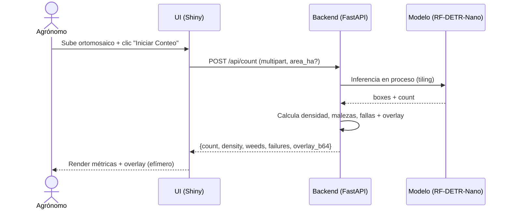
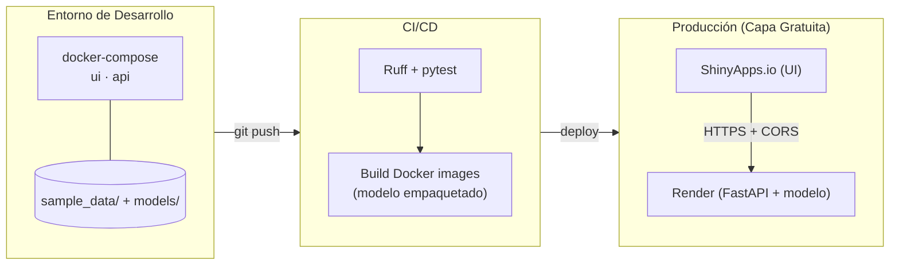

# Arquitectura — AgroVisión MVP (Conteo por Dron)

> **Audiencia:** Arquitectos de solución, líderes técnicos, desarrolladores.
> **Alcance:** Estructura del **MVP** (conteo por dron + credenciales efímeras). Topología simplificada y síncrona. Para especificaciones funcionales, ver [`description_proyecto_agrovision_mvp.md`](../reference/description_proyecto_agrovision_mvp.md). Para la arquitectura objetivo completa, ver [`architecture_agrovision.md`](architecture_agrovision.md).

---

## 1. Visión General del Sistema (C4 – Nivel Contexto)

**Decisiones arquitectónicas clave (Nivel Macro):**
- **Sin dependencias externas para la función núcleo:** el conteo corre con el modelo empaquetado; no requiere llaves de API.
- **Inferencia síncrona:** sin cola ni worker — máxima simplicidad para validar el flujo.
- **Sin base de datos:** todo es efímero (memoria de sesión); refrescar borra todo.
- **Credenciales efímeras (placeholder):** la pestaña existe como base para módulos futuros, con el aviso de no-persistencia.

---

## 2. Componentes Internos (C4 – Nivel Contenedor)

**Flujo de una interacción típica:**
1. El agrónomo sube un ortomosaico en la UI y pulsa "Iniciar Conteo".
2. La UI envía `POST /api/count` (multipart) al backend.
3. El backend ejecuta RF-DETR-Nano **en proceso** (con *tiling* si es grande) y devuelve conteo + overlay (base64).
4. La UI renderiza métricas y overlay. **Nada se persiste.**

> **Variante monolítica:** para máxima simplicidad, UI + inferencia pueden vivir en **un solo contenedor** (Shiny llamando al modelo en proceso), evitando CORS y dos servicios.

---

## 3. Lógica Core / Procesos Críticos

---

## 4. Flujo de Secuencia (Conteo Síncrono)

---

## 5. Modelo de Dominio / Entidad-Relación

**El MVP no persiste datos.** No hay base de datos: la información de cada corrida vive en `reactive.value` de la sesión Shiny y se descarta al refrescar/cerrar.

> **Futuro:** al evolucionar a la plataforma completa, los conteos se persistirían en la tabla `plant_counts` definida en [`docs/db/diseno_db.md`](../db/diseno_db.md).

**Políticas de Datos (MVP):**
- **Efimeralidad total:** sin disco, sin BD, sin `localStorage`.
- **Aislamiento por sesión:** cada WebSocket Shiny es independiente.

---

## 6. Arquitectura de Despliegue (Infraestructura)

**Notas de despliegue:**
- Dos servicios (UI + backend) **o** un único contenedor monolítico (Shiny + inferencia) en Render / Hugging Face Spaces.
- El modelo `agrovision-plantcount-v2.0.0.onnx` (ONNX ligero, **agnóstico** a la arquitectura: YOLO26/RF-DETR) cabe holgado en los 512 MB de Render.
- El **módulo de conteo arranca en standby** (`COUNTING_ENABLED=false`) hasta que el repo del modelo publique el artefacto en Hugging Face Hub. Licencia: AGPL-3.0 aceptada (app open-source).

---

## 7. Decisiones Arquitectónicas Relevantes (ADRs Resumidos)

| Decisión Tomada | Alternativa Descartada | Razón Principal |
| :--- | :--- | :--- |
| **Inferencia síncrona en proceso** | Cola PGMQ + worker (plataforma completa) | El MVP valida el flujo con mínima complejidad; el modelo ligero responde en segundos. |
| **Sin base de datos (efímero)** | Supabase PostGIS desde el inicio | El núcleo de valor (conteo) no requiere persistencia; evita configurar BYOK para la demo. |
| **Conteo sin llaves de API** | BYOK obligatorio | El modelo corre local; el usuario obtiene valor sin configurar credenciales. |
| **UI en Shiny for Python** | Streamlit / Astro | Coherencia con la plataforma completa; reutiliza la misma base de código de UI. |
| **Opción monolítica de despliegue** | Siempre dos servicios | Para el MVP, un contenedor único reduce CORS y complejidad operativa. |

> Todos los componentes del MVP son un **subconjunto estricto** de la [arquitectura completa](architecture_agrovision.md); evolucionar es activar módulos, no reescribir.
