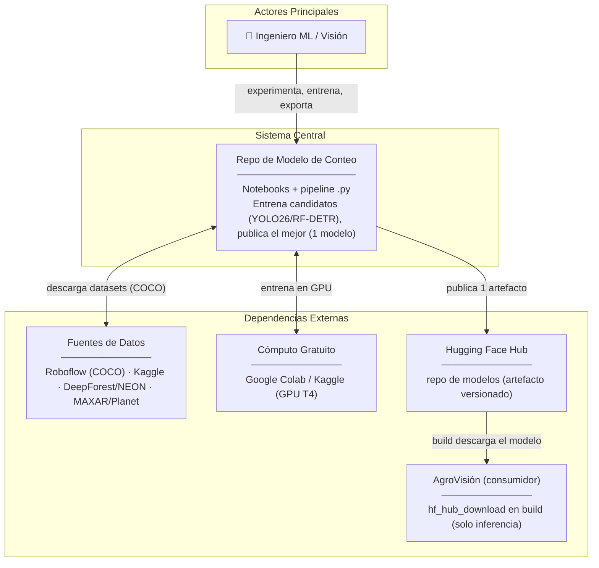
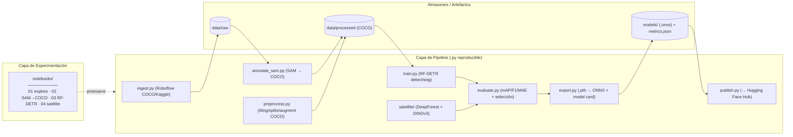
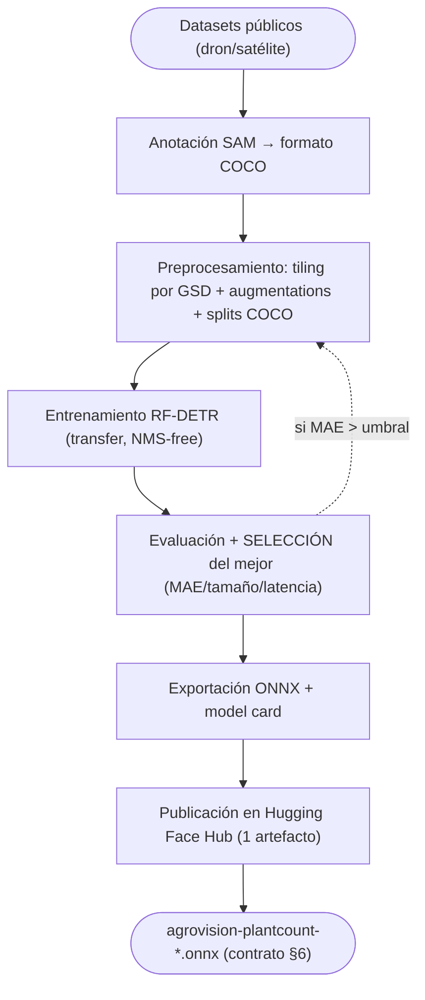
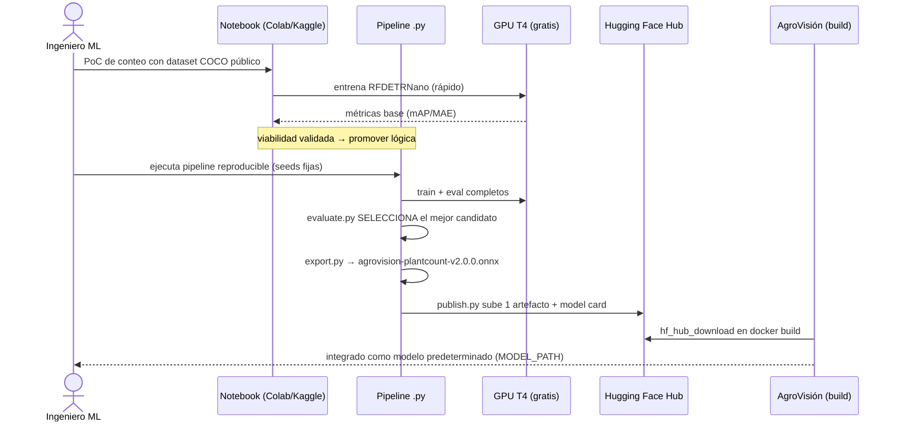
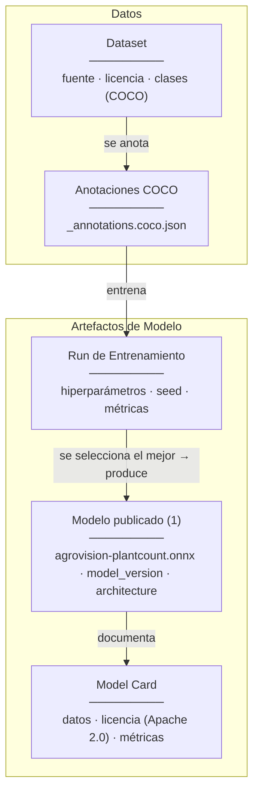
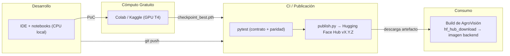

# Arquitectura — Modelo de Conteo de Plantas (Repo Separado)

> **Audiencia:** Ingenieros de ML/visión, líderes técnicos.
> **Alcance:** Estructura del **repositorio de modelado** (pipeline ML), no de una app productiva. Su salida es **UN artefacto** (`agrovision-plantcount-*.onnx`) publicado en **Hugging Face Hub** y consumido por AgroVisión. Para especificaciones, ver [`description_proyecto_modelo_conteo_plantas.md`](../reference/description_proyecto_modelo_conteo_plantas.md).
> **Modelo (multi-candidato):** se evalúan **YOLO26** (AGPL-3.0, NMS-free), **RF-DETR** (Apache 2.0, NMS-free) y **DINOv3**; se publica **el mejor** (menor MAE). **AGPL aceptada** (app open-source) → YOLO26 usable. **Multi-cultivo** (arándano primero). DeepForest (MIT) para satélite. **Sin BD transaccional** (persistencia = datasets/artefactos versionados).

---

## 1. Visión General del Sistema (C4 – Nivel Contexto)

**Decisiones arquitectónicas clave (Nivel Macro):**
- **Notebooks-first:** validar viabilidad en notebooks (Colab/Kaggle) antes de promover a `.py`.
- **1 solo artefacto publicado:** se entrenan varios candidatos, se selecciona el mejor y **solo ese** se sube a HF Hub.
- **RF-DETR (Apache 2.0) NMS-free** como primario (permisivo, CPU) + **DINOv3/DeepForest** (satélite).
- **Nombre desacoplado:** `agrovision-plantcount` (no depende de la arquitectura interna).

---

## 2. Componentes Internos (C4 – Nivel Contenedor)

**Flujo de una interacción típica:**
1. El ingeniero **explora** datos y valida un conteo base en `03_train_rfdetr.ipynb`.
2. Promueve la lógica a `src/*.py`: `ingest` → `annotate_sam` (→ COCO) → `preprocess` → `train` → `evaluate` (**selecciona el mejor**) → `export` → `publish`.
3. `export.py` genera `agrovision-plantcount-vX.Y.Z.onnx`; `publish.py` lo sube a **HF Hub**.
4. El build de AgroVisión lo descarga con `hf_hub_download` como modelo predeterminado.

---

## 3. Lógica Core / Proceso Crítico (Pipeline ML)

---

## 4. Flujo de Secuencia (Experimentación → Producción → Handoff)

---

## 5. Modelo de Dominio / Artefactos (no hay BD transaccional)

**Políticas de Datos:**
- **Versionado de datos:** `data/` no se commitea; se versiona el *manifiesto* (fuente, hash, licencia) y opcionalmente con **DVC**.
- **1 artefacto:** solo el modelo seleccionado se publica (HF Hub); su `model_version` (SemVer) enlaza run/dataset/métricas.
- **Reproducibilidad:** semillas fijas y config declarativa.

---

## 6. Arquitectura de Despliegue (Publicación de Artefactos)

---

## 7. Decisiones Arquitectónicas Relevantes (ADRs Resumidos)

| Decisión Tomada | Alternativa Descartada | Razón Principal |
| :--- | :--- | :--- |
| **Multi-candidato: YOLO26 + RF-DETR + DINOv3, se publica el mejor** | Fijar un solo modelo de entrada | Gana el de **menor MAE** (tamaño/latencia OK). **AGPL-3.0 aceptada** (app open-source) habilita YOLO26; RF-DETR (Apache) queda como alternativa permisiva. App **agnóstica por contrato**. |
| **Anotar a COCO + YOLO** | Un solo formato | Se anota una vez y se exporta a **COCO** (para RF-DETR) y **YOLO** (para YOLO26), permitiendo entrenar ambos candidatos. |
| **Publicar en Hugging Face Hub** | GitHub Releases / object storage | Hosting de modelos versionado y estándar; `hf_hub_download` integra en el build de AgroVisión. |
| **1 solo artefacto, el mejor** | Publicar todos los tracks | Simplicidad para el consumidor; los tracks son experimentos para elegir al ganador. |
| **Nombre desacoplado** (`agrovision-plantcount`) | Nombre por arquitectura (`rfdetr_nano`) | Permite cambiar de modelo sin tocar la app; el contrato es lo estable. |
| **DINOv3 + DeepForest** (satélite) | Entrenar conteo de árboles desde cero | DeepForest (MIT) preentrenado + DINOv3 satelital sin fine-tuning aceleran el track. |
| **Notebooks-first** | Ir directo a `.py` | Validar viabilidad barato antes de endurecer; cada notebook tiene su par `.py` testeado. |
| **Sin BD transaccional** | Postgres/registro pesado | El dominio son datasets/artefactos versionados (manifiestos + DVC + HF Hub). |
