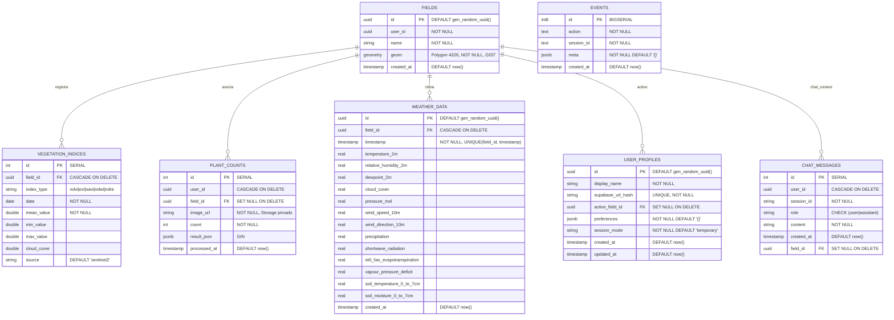

# Especificación y Diseño de Base de Datos — AgroVisión (Plataforma Completa)

> **Propósito:** Definir el modelo físico y lógico de persistencia de AgroVisión, justificar la elección del motor y servir como mapa de referencia para migraciones e implementación.
> **Origen:** Se construye a partir de [`docs/reference/description_proyecto_agrovision.md`](../reference/description_proyecto_agrovision.md).
> **Aplicabilidad:** Solo la **plataforma completa**. (El MVP histórico operaba en modo efímero sin base de datos.)
>
> **Alcance de construcción (esta iteración):** se implementan **todas** las tablas:
> - **`fields`, `vegetation_indices`, `chat_messages`** se usan activamente (parcelas, teledetección 5 índices espectrales, agente).
> - **`plant_counts`** y la **cola PGMQ `count_tasks`** se crean en la migración pero quedan **inactivas** (el módulo de Conteo está **en desarrollo**); se activan con `COUNTING_ENABLED=true`.
> - **`weather_data`** persiste series horarias de clima con 13 variables climáticas asociadas a cada parcela.
> - **`user_profiles`** gestiona la configuración de los perfiles de usuario y las preferencias de sesión (temporal/guardada).
>
> **Persistencia de credenciales:** ninguna. Las llaves del usuario (Supabase URL/anon, Copernicus, Groq) son **efímeras** (memoria de sesión); la BD es BYOK (proyecto Supabase del propio usuario).

---

## 1. Criterios de Selección del Motor de Base de Datos

*   **Motor Seleccionado:** **PostgreSQL 16 + extensión PostGIS 3.4**, provisto por **Supabase** (capa gratuita). Modelo **BYOK**: cada usuario aporta su propio proyecto Supabase; el repo entrega las migraciones.
*   **Justificación Técnico:**
    *   *Consistencia vs. Flexibilidad:* se elige **SQL relacional** porque el agente conversacional (function calling) ejecuta *joins* entre `fields` y `vegetation_indices`, requiere integridad referencial (FK con `ON DELETE CASCADE`) y cálculos agregados. Para los resultados heterogéneos de detección YOLO se usa una columna **`JSONB`** (`result_json`), obteniendo flexibilidad documental sin renunciar a ACID.
    *   *Capacidad espacial:* **PostGIS** es innegociable — almacena `geometry(Polygon, 4326)`, calcula áreas (`ST_Area`) para densidad pl/Ha e indexa con **GIST**. Ningún NoSQL ofrece este soporte geográfico nativo de forma gratuita y madura.
    *   *Cola embebida:* **Supabase Queues (PGMQ)** vive dentro del mismo Postgres, dando mensajería transaccional ACID sin broker externo (no Redis/RabbitMQ) — clave para el costo cero.
    *   *Concurrencia:* Postgres gestiona bloqueos de fila óptimamente; el worker usa *visibility timeout* (vt=120) de PGMQ para exclusión mutua sobre tareas.
    *   *Infraestructura:* Supabase Free (500 MB DB, *connection pooler* incluido, pausa a 7 días sin actividad — mitigada con keep-alive).

---

## 2. Diagrama de Entidad-Relación (ERD)

---

## 3. Diccionario de Datos (Tablas)

### 3.1 Tabla: `fields`
*   **Descripción:** Parcelas o lotes agrícolas georreferenciados del usuario.

| Campo | Tipo de Dato | Modificadores | Descripción / Regla de Negocio |
| :--- | :--- | :--- | :--- |
| `id` | `UUID` | `PK`, `DEFAULT gen_random_uuid()` | Identificador único. |
| `user_id` | `UUID` | `NOT NULL` | Propietario del lote. |
| `name` | `TEXT` | `NOT NULL` | Nombre legible (canonicalizado a *Title Case*). |
| `geom` | `GEOMETRY(Polygon, 4326)` | `NOT NULL` | Polígono WGS84; validado con `ST_IsValid`. |
| `created_at` | `TIMESTAMP` | `DEFAULT now()` | Fecha de creación. |

*   **Restricciones:** `ST_IsValid(geom)` debe ser verdadero; SRID siempre 4326.

### 3.2 Tabla: `vegetation_indices`
*   **Descripción:** Serie temporal histórica de 5 índices espectrales (NDVI/EVI/SAVI/NDWI/NDRE) derivados de Sentinel-2. Se persiste **agregada por mes** (un punto por mes por índice, la escena de menor nubosidad), con un **backfill inicial de 5 años** al crear la parcela y refresco **incremental** después.

| Campo | Tipo de Dato | Modificadores | Descripción / Regla de Negocio |
| :--- | :--- | :--- | :--- |
| `id` | `SERIAL` | `PK` | Identificador secuencial. |
| `field_id` | `UUID` | `FK (fields.id)`, `ON DELETE CASCADE` | Lote asociado. |
| `index_type` | `TEXT` | `NOT NULL` | Tipo de índice: `ndvi`, `evi`, `savi`, `ndwi`, `ndre`. |
| `date` | `DATE` | `NOT NULL` | Fecha de la escena satelital (primer día del mes). |
| `mean_value` | `DOUBLE PRECISION` | `NOT NULL` | Valor medio zonal del índice. |
| `min_value` / `max_value` | `DOUBLE PRECISION` | — | Extremos zonales. |
| `cloud_cover` | `DOUBLE PRECISION` | — | % de nubes; > 60 % marca baja confianza. |
| `source` | `TEXT` | `DEFAULT 'sentinel2'` | Origen (minúsculas). |

*   **Restricciones:** `UNIQUE (field_id, index_type, date)` — una observación por lote, índice y fecha; el `UNIQUE` hace **idempotente** el backfill/refresco incremental.

### 3.3 Tabla: `user_profiles`
*   **Descripción:** Gestión de perfiles de usuario y preferencias de sesión asociadas de forma segura.

| Campo | Tipo de Dato | Modificadores | Descripción / Regla de Negocio |
| :--- | :--- | :--- | :--- |
| `id` | `UUID` | `PK`, `DEFAULT gen_random_uuid()` | Identificador del perfil. |
| `display_name` | `VARCHAR(100)` | `NOT NULL` | Nombre del agrónomo/usuario. |
| `supabase_url_hash` | `VARCHAR(64)` | `UNIQUE`, `NOT NULL` | Fingerprint SHA-256 del host Supabase. |
| `active_field_id` | `UUID` | `FK (fields.id)`, `ON DELETE SET NULL` | Parcela activa del perfil. |
| `preferences` | `JSONB` | `NOT NULL DEFAULT '{}'` | Preferencias (ej. índice por defecto, unidades). |
| `session_mode` | `VARCHAR(20)` | `NOT NULL DEFAULT 'temporary'` | Modo de sesión: `ephemeral` o `saved`. |
| `created_at` | `TIMESTAMP` | `DEFAULT now()` | Fecha de registro. |
| `updated_at` | `TIMESTAMP` | `DEFAULT now()` | Fecha de actualización. |

### 3.4 Tabla: `weather_data`
*   **Descripción:** Persistencia horaria del histórico de 13 variables climáticas obtenidas de Open-Meteo por parcela.

| Campo | Tipo de Dato | Modificadores | Descripción / Regla de Negocio |
| :--- | :--- | :--- | :--- |
| `id` | `UUID` | `PK`, `DEFAULT gen_random_uuid()` | Identificador de fila. |
| `field_id` | `UUID` | `FK (fields.id)`, `ON DELETE CASCADE` | Parcela vinculada. |
| `timestamp` | `TIMESTAMPTZ` | `NOT NULL` | Marca horaria consciente de zona horaria (UTC). |
| `temperature_2m` | `REAL` | — | Temperatura del aire a 2 metros (°C). |
| `relative_humidity_2m` | `REAL` | — | Humedad relativa a 2 metros (%). |
| `dewpoint_2m` | `REAL` | — | Punto de rocío a 2 metros (°C). |
| `cloud_cover` | `REAL` | — | Cobertura total de nubes (%). |
| `pressure_msl` | `REAL` | — | Presión a nivel del mar (hPa). |
| `wind_speed_10m` | `REAL` | — | Velocidad del viento a 10 metros (m/s). |
| `wind_direction_10m` | `REAL` | — | Dirección del viento a 10 metros (°). |
| `precipitation` | `REAL` | — | Precipitaciones totales (mm). |
| `shortwave_radiation` | `REAL` | — | Radiación solar de onda corta (W/m²). |
| `et0_fao_evapotranspiration` | `REAL` | — | Evapotranspiración de referencia FAO (mm). |
| `vapour_pressure_deficit` | `REAL` | — | Déficit de presión de vapor (kPa). |
| `soil_temperature_0_to_7cm` | `REAL` | — | Temperatura del suelo de 0 a 7 cm (°C). |
| `soil_moisture_0_to_7cm` | `REAL` | — | Humedad del suelo de 0 a 7 cm (m³/m³). |
| `created_at` | `TIMESTAMPTZ` | `DEFAULT now()` | Fecha de creación del registro. |

*   **Restricciones:** `UNIQUE (field_id, timestamp)` para posibilitar upserts horarios idempotentes.

### 3.5 Tabla: `plant_counts` (creada, **inactiva** — Conteo en desarrollo)
*   **Descripción:** Resultados de conteo por dron (inferencia del modelo **agnóstico** `agrovision-plantcount`). La tabla se crea en la migración inicial pero **no recibe escrituras** hasta activar `COUNTING_ENABLED=true`.

| Campo | Tipo de Dato | Modificadores | Descripción / Regla de Negocio |
| :--- | :--- | :--- | :--- |
| `id` | `SERIAL` | `PK` | Identificador secuencial. |
| `user_id` | `UUID` | `ON DELETE CASCADE` | Quién ejecutó el conteo. |
| `field_id` | `UUID` | `FK (fields.id)`, `ON DELETE SET NULL` | Lote (opcional). |
| `image_url` | `TEXT` | `NOT NULL` | Ruta en Storage privado (no pública). |
| `count` | `INTEGER` | `NOT NULL` | Conteo total de plantas. |
| `result_json` | `JSONB` | — | `{"boxes":[[x1,y1,x2,y2,conf,cls]],"classes":{...},"model_version":"2.0.0"}` |
| `processed_at` | `TIMESTAMP` | `DEFAULT now()` | Momento de la inferencia. |

*   **Restricciones:** `count >= 0`; cada `conf` en `result_json` dentro de $[0,1]$ (validado en la app).

### 3.6 Tabla: `chat_messages`
*   **Descripción:** Memoria conversacional del asistente RAG, asociada opcionalmente a parcelas.

| Campo | Tipo de Dato | Modificadores | Descripción / Regla de Negocio |
| :--- | :--- | :--- | :--- |
| `id` | `SERIAL` | `PK` | Identificador secuencial. |
| `user_id` | `UUID` | `ON DELETE CASCADE` | Dueño de la conversación. |
| `session_id` | `TEXT` | `NOT NULL` | Hilo conversacional. |
| `role` | `TEXT` | `NOT NULL`, `CHECK (role IN ('user','assistant'))` | Emisor del mensaje. |
| `content` | `TEXT` | `NOT NULL` | Texto del turno. |
| `created_at` | `TIMESTAMP` | `DEFAULT now()` | Orden temporal. |
| `field_id` | `UUID` | `FK (fields.id)`, `ON DELETE SET NULL` | Parcela asociada para acotar contexto. |

---

### 3.7 Tabla: `events` (Telemetría de UI — Fase 9, persistencia **opcional**)
*   **Descripción:** Traza de acciones de la UI para depurar. Se escribe **solo** si `EVENTS_PERSIST=true` (best-effort). El backend **redacta** `meta` antes de insertar: **nunca** contiene secretos. Por defecto la telemetría vive solo en stdout + un ring buffer en memoria (`GET /api/events/recent`).

| Campo | Tipo de Dato | Modificadores | Descripción / Regla de Negocio |
| :--- | :--- | :--- | :--- |
| `id` | `BIGSERIAL` | `PK` | Identificador secuencial. |
| `action` | `TEXT` | `NOT NULL` | Acción (`nav`, `creds_set`, `parcel_create`, `chart_view`, `api_error`…). |
| `session_id` | `TEXT` | `NOT NULL` | Correlación por sesión de UI. |
| `meta` | `JSONB` | `NOT NULL DEFAULT '{}'` | Contexto **ya redactado** (contadores, pestaña, status…). |
| `created_at` | `TIMESTAMP` | `DEFAULT now()` | Orden temporal. |

---

## 4. Matriz de Accesos y CRUD por Componente

| Tabla | Gateway (FastAPI) | Worker Asíncrono | UI (Astro) | Permisos | Notas de Diseño |
| :--- | :--- | :--- | :--- | :--- | :--- |
| `fields` | `ParcelsService` (CRUD) + dispara backfill | *Ninguno* | vía API (módulo *Creación de Parcelas*) | `API: CRUD` | La UI nunca toca la BD directo; pasa por el gateway. Al crear, encola/lanza el backfill de 5 años. |
| `vegetation_indices` | `RemoteSensingService` (write, mensual) | *Ninguno* | lectura vía API (*Teledetección*, *Resumen*) | `API: Read/Write` | Escritura tras estadística zonal + agregación mensual; el UNIQUE hace la inserción idempotente. |
| `weather_data` | `WeatherService` (write horaria, read) | *Ninguno* | lectura vía API (*Teledetección*) | `API: Read/Write` | Almacenamiento de variables horarias; agregación en backend antes de enviar a la UI. |
| `user_profiles` | `ProfilesService` (CRUD) | *Ninguno* | lectura/escritura vía API (*Ajustes*) | `API: CRUD` | Permite conservar configuraciones de sesión no críticas sin guardar API keys. |
| `plant_counts` | `CountService` (read) | `InferenceWorker` (write) | lectura vía API | `API: Read`   `Worker: Write` | **En desarrollo:** sin escrituras hasta `COUNTING_ENABLED=true`. |
| `chat_messages` | `AgentService` | *Ninguno* | lectura vía API (*Asistente*) | `API: Read/Write` | Memoria del agente con soporte de acotamiento por `field_id`. |
| `events` | `events` router (write best-effort) | *Ninguno* | escritura vía `POST /api/events` (telemetría) | `API: Write`   (opcional) | **Opcional** (`EVENTS_PERSIST=true`). Sin secretos (redactado). Por defecto solo buffer en memoria. |
| `pgmq.count_tasks` (cola) | `CountService` (produce) | `InferenceWorker` (consume) | — | `API: send`   `Worker: read/archive` | **En desarrollo:** cola creada pero inactiva hasta activar el conteo. |

> **NDVI raster / heatmap:** el endpoint `POST /api/ndvi/raster` genera un PNG colorizado **on-demand** (no escribe en BD ni en Storage; se regenera). No aparece en la matriz por no tocar persistencia.

> **Regla de aislamiento:** la UI Astro **no** posee credenciales de BD propias; el acceso es siempre mediado por el gateway, que recibe las llaves del usuario por cabecera y las descarta.

---

## 5. Rendimiento, Índices y Concurrencia

### 5.1 Índices Planificados
*   **`fields_geom_gist_idx`** en `fields USING gist (geom)` — acelera operaciones espaciales (intersección, área).
*   **`vegetation_indices_field_type_date_idx`** en `vegetation_indices (field_id, index_type, date)` — optimiza filtros de fecha/índice del agente.
*   **`weather_data_field_timestamp_idx`** en `weather_data (field_id, timestamp DESC)` — optimiza consultas de series temporales de clima.
*   **`user_profiles_supabase_url_hash_idx`** en `user_profiles (supabase_url_hash)` — aceleración de la reconexión de perfiles.
*   **`plant_counts_json_gin_idx`** en `plant_counts USING gin (result_json)` — búsquedas/agregaciones sobre el JSONB de detecciones.
*   **`chat_session_history_idx`** en `chat_messages (session_id, created_at)` — recuperación ordenada del historial.
*   **`events_session_created_idx`** en `events (session_id, created_at)` — traza de una sesión ordenada (depuración; tabla opcional).

### 5.2 Control de Concurrencia y Seguridad
*   **Row Level Security (RLS):** políticas `auth.uid() = user_id` o vinculación con dueños de parcelas en todas las tablas para aislar usuarios dentro del mismo proyecto Supabase.
*   **Cola PGMQ:** *visibility timeout* `vt=120` garantiza que un solo worker procese cada tarea; si falla, el mensaje reaparece y se reintenta.
*   **Storage privado:** bucket `drone-images` privado; acceso solo vía **Signed URLs** (`expires_in=600`).

### 5.3 Estrategia de Migraciones y Versionado
*   **Herramienta primaria:** **Supabase CLI** con migraciones SQL versionadas (`supabase/migrations/*.sql`), aplicadas con `supabase db push` (idempotentes).
*   **Alternativa local (dev):** **Alembic** o script de migración nativo (`backend/db/migrate.py`) cuando se trabaja contra el Postgres+PostGIS de `docker-compose`.
*   **Política:** prohibido alterar el esquema manualmente en producción; todo cambio pasa por una migración versionada y revisable.
*   **Orden de bootstrap:** (1) `create extension postgis`; (2) `create extension pgmq` / habilitar Supabase Queues; (3) tablas + índices; (4) políticas RLS; (5) bucket de Storage privado.

---

## Apéndice — Trazabilidad

El esquema deriva directamente de la sección 3 de [`description_proyecto_agrovision.md`](../reference/description_proyecto_agrovision.md) y de las herramientas del agente (sección 5.4). De este documento se derivan las tareas de la **Fase de Persistencia** del [Plan Maestro completo](../plan/plan_agrovision.md).
