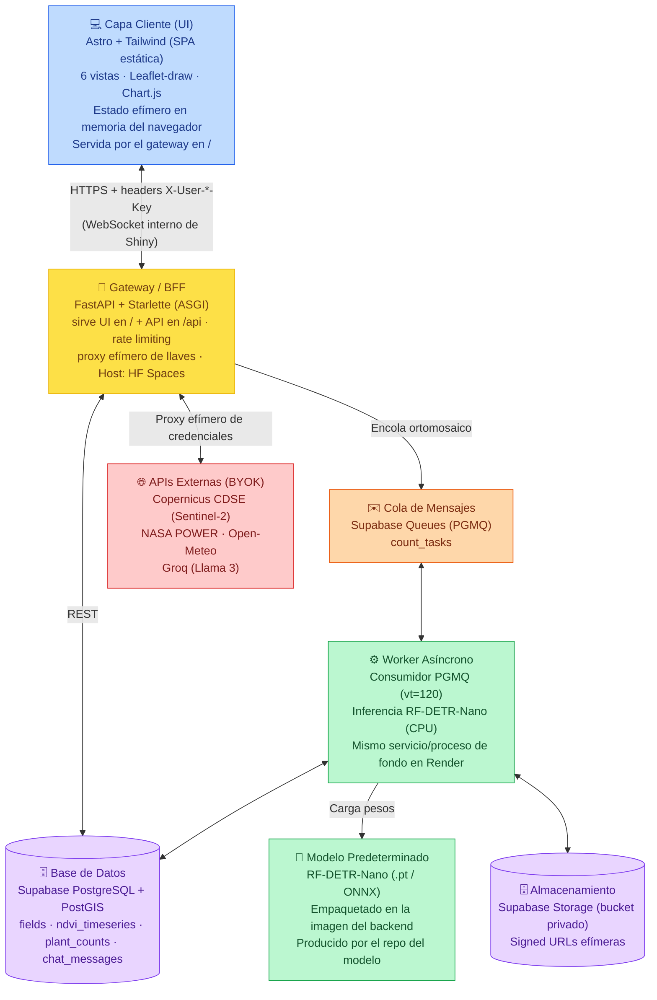
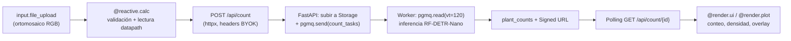
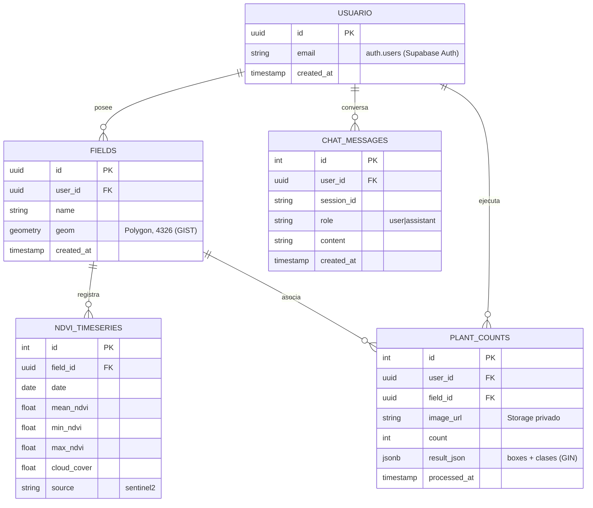

# Documento de Definición Técnica — AgroVisión (Plataforma Completa)

> **Propósito del documento:** Servir como única fuente de verdad técnica y funcional para desarrolladores, arquitectos y sistemas de inteligencia artificial. Define la arquitectura modular, flujos de datos, APIs, modelos de base de datos, lógica de negocio y configuraciones del sistema de la plataforma AgroVisión.
>
> **Stack confirmado:** UI en **Astro + Tailwind** (SPA estática), backend/gateway en **FastAPI** (sirve la UI en `/` y la API en `/api`), base de datos en **Supabase (PostgreSQL + PostGIS + Storage + Queues/PGMQ)**, agente conversacional con **Groq (Llama 3)** y teledetección con **Copernicus Sentinel-2 / NASA POWER / Open-Meteo**. Despliegue gratuito: **Hugging Face Spaces (Docker)**; alternativa Render.
>
> ⚠️ **Actualización (Fases 8 y 10):** este documento se redactó con la UI original en **Shiny for Python**. Desde la **Fase 8** la UI es **Astro + Tailwind** servida por el gateway, y en la **Fase 10 Shiny se eliminó por completo** (sin `/shiny`) y el despliegue pasó a **Hugging Face Spaces** (shinyapps.io quedó descartado: solo hospeda Shiny, no FastAPI). Donde el texto diga "Shiny / reactive.value / WebSocket / ShinyApps.io", léase: **SPA Astro en el navegador / estado en memoria del navegador / HF Spaces**. La arquitectura vigente está en [`architecture_agrovision.md`](../architect/architecture_agrovision.md) (incl. §8 Seguridad).
>
> **Licencia y modelo:** AgroVisión es **open-source bajo AGPL-3.0** (lo que permite usar **YOLO26**). El modelo de conteo es **agnóstico**: la app consume el artefacto `agrovision-plantcount` (multi-candidato YOLO26/RF-DETR) por **contrato**, vía un adaptador de inferencia. El **módulo de conteo arranca en _standby_** (flag `COUNTING_ENABLED=false`) hasta que el **repo del modelo** (proyecto separado) publique el artefacto.
>
> **Documentos relacionados:**
> - El modelo de conteo se desarrolla en un **repo separado** (produce los pesos predeterminados).
> - Investigación base: [`Plan Detallado Data Science Agrícola.md`](../investigation/Plan%20Detallado%20Data%20Science%20Agr%C3%ADcola.md)
> - Mockup interactivo: [`agrovisi_n_spa_prototype.html`](../investigation/agrovisi_n_spa_prototype.html)

---

## 0. Resumen Ejecutivo

AgroVisión es una plataforma de **monitoreo agronómico de precisión** que unifica tres pilares tecnológicos en una sola interfaz: (1) **teledetección satelital** con índices vegetativos sobre Sentinel-2, (2) **visión computacional** para el conteo automatizado de plantas a partir de ortomosaicos RGB capturados por drones, y (3) un **agente conversacional (RAG)** que contextualiza el historial de las parcelas con datos climáticos y de campo.

El sistema se diseña sobre una arquitectura **de código abierto, sin servidores de costo fijo y desplegable íntegramente en capa gratuita**, bajo un paradigma estricto de **"Trae tu Propia Llave" (Bring Your Own Keys, BYOK)** con **cero persistencia de credenciales**.

*   **Propósito:** Centralizar fuentes geoespaciales (satélite, dron, clima) para optimizar decisiones agronómicas en campo, sin costos de infraestructura y sin exponer claves propietarias.
*   **Usuarios Objetivos:** Agrónomos, productores y consultores agrícolas.
*   **Casos de Uso Core:**
    1.  El usuario **delimita una parcela** sobre un mapa interactivo (polígono EPSG:4326) y consulta la **serie temporal de NDVI** de Sentinel-2 cruzada con clima de NASA POWER / Open-Meteo.
    2.  El usuario **sube un ortomosaico RGB del dron**; el sistema ejecuta el **modelo de conteo predeterminado** (agnóstico: YOLO26/RF-DETR, entrenado en un repo aparte) y devuelve **conteo de plantas, densidad por hectárea, malezas y fallas de siembra**.
    3.  El usuario **conversa con el agente AI**, que invoca funciones tipadas (function calling) sobre la base de datos y las APIs externas para producir un diagnóstico agronómico argumentado.
    4.  El usuario **introduce sus credenciales** en la última pestaña; estas viven **solo en memoria de sesión**, no se guardan ni almacenan, y **se borran al refrescar la página**.

> **Decisión de diseño clave (efimeralidad):** A diferencia del mockup original (que usaba `localStorage`), esta plataforma mantiene credenciales y datos del usuario exclusivamente en el **estado reactivo en memoria de la sesión de Shiny**. Cada conexión WebSocket es una sesión aislada; al refrescar/cerrar la pestaña, la sesión se destruye y **todo dato se pierde**. Esto elimina cualquier vector de persistencia accidental de secretos.

---

## 1. Arquitectura de Componentes (Modular y Desacoplada)

La plataforma es un **gateway único**: el backend **FastAPI** sirve la **UI Astro estática** en `/` y la **API** en `/api` (mismo origen). *(El diseño original separaba UI Shiny y backend; desde la Fase 10 es un solo servicio — ver banner arriba.)* El cómputo pesado (inferencia de visión, descargas satelitales) queda aislado en `services/`.



### 1.1 Glosario de Módulos e Infraestructura

| Componente | Descripción de Responsabilidad | Tecnologías | Estrategia de Resiliencia / Despliegue |
| :--- | :--- | :--- | :--- |
| **Capa Cliente (UI)** | Interfaz interactiva de 6 módulos. Gestiona estado local **efímero** (credenciales, parcela activa, resultados) y orquesta llamadas al gateway. | **Astro + Tailwind** (SPA estática), Leaflet-draw, Chart.js (CDN) | Compilada a estático y **servida por el gateway en `/`**. Estado en memoria del navegador; refrescar = reset total. |
| **Gateway / BFF** | Punto de entrada único. Sirve la UI Astro, valida CORS, aplica rate limiting, recibe llaves por cabecera, orquesta teledetección, encola inferencia y proxy del LLM. | FastAPI, Starlette, `httpx` | 1 contenedor en **Hugging Face Spaces** (Docker). Sin secretos persistidos. |
| **Worker Asíncrono** | Consume la cola PGMQ, ejecuta inferencia RF-DETR-Nano sobre ortomosaicos, persiste conteos y genera Signed URLs. | FastAPI background task / proceso, onnxruntime, OpenCV, `pgmq-sqlalchemy` (asyncpg) | Reintento automático por *visibility timeout* (vt=120). Tolerante a reinicios del contenedor gratuito. |
| **Base de Datos + GIS** | Almacén relacional/espacial del dominio (parcelas, series NDVI, conteos, chat). | Supabase PostgreSQL + **PostGIS** | **Supabase Free** (500 MB DB). Índices GIST/GIN. Modelo BYOK (proyecto del usuario). Keep-alive contra pausa a 7 días. |
| **Almacenamiento de Objetos** | Custodia privada de ortomosaicos e imágenes de resultado. | Supabase Storage | Bucket **privado**; visualización solo vía **Signed URLs** (`expires_in=600`). |
| **Cola de Mensajes** | Desacopla la subida de imágenes pesadas de la inferencia para evitar *timeouts*. | Supabase Queues (**PGMQ** / pgmq) | Transaccional ACID embebido en Postgres; sin broker externo (no Redis). |
| **Modelo de Visión** | Pesos preentrenados de conteo; **solo inferencia**, nunca entrenamiento. Se carga vía **adaptador de inferencia** (onnxruntime o `ultralytics` según la arquitectura ganadora) — **agnóstico** al modelo. Arranca en **standby**. | `agrovision-plantcount` (ONNX; multi-candidato YOLO26/RF-DETR) | Artefacto **predeterminado** de Hugging Face Hub (build); **AGPL-3.0 aceptada** (app open-source). |

---

## 2. Flujo de Datos e Integración

### 2.1 Orígenes y Destinos de Datos

*   **Entradas del Sistema:**
    *   *Inputs de Usuario:* Polígonos de parcela (mapa interactivo → GeoJSON EPSG:4326), **carga de ortomosaico RGB del dron** (`ui.input_file`), consultas al chat, **credenciales BYOK** (Groq, Copernicus, Supabase URL + anon key).
    *   *Sincronizaciones Externas:* Sentinel-2 L2A (Copernicus CDSE vía STAC), NASA POWER (REST por coordenadas), Open-Meteo (REST público sin llave), Groq (inferencia LLM).
*   **Salidas del Sistema:**
    *   *Visualizaciones:* KPIs, series NDVI vs. clima (Plotly), ortomosaico con *bounding boxes* (Signed URL efímera), respuestas del agente.
    *   *Persistencia opcional (Supabase del usuario):* `fields`, `ndvi_timeseries`, `plant_counts`, `chat_messages`.

### 2.2 Grafo de Dependencias Reactivas y Propagación

Shiny es un framework **reactivo**: los `input.*` disparan `@reactive.calc` y `@render.*` automáticamente. El flujo de una operación de conteo es:



> **Nota de efimeralidad en el flujo:** las credenciales viajan en cada petición como cabeceras `X-User-Groq-Key`, `X-User-Copernicus-Secret`, etc. El gateway las usa **en la ejecución** y las descarta; nunca se escriben a disco, log ni base de datos. En la UI residen en un `reactive.value` que muere con la sesión.

---

## 3. Modelo de Datos (Bases de Datos)

> El esquema es **BYOK**: el usuario provee su propio proyecto Supabase (URL + anon key, inyectados por sesión). El repo entrega las **migraciones** para crearlo en una cuenta gratuita. La persistencia es **opcional**: la plataforma funciona en modo efímero (sin BD) y solo escribe cuando el usuario configura Supabase.

### 3.1 Diagrama Entidad-Relación (ERD)



### 3.2 DDL de Referencia (PostGIS)

```sql
-- Extensión espacial
create extension if not exists postgis;

-- 1. Parcelas / Lotes agrícolas
create table fields (
  id uuid primary key default gen_random_uuid(),
  user_id uuid references auth.users on delete cascade,
  name text not null,
  geom geometry(Polygon, 4326) not null,   -- WGS84
  created_at timestamp default now()
);
create index fields_geom_gist_idx on fields using gist (geom);

-- 2. Serie temporal de índices vegetativos (Sentinel-2)
create table ndvi_timeseries (
  id serial primary key,
  field_id uuid references fields on delete cascade,
  date date not null,
  mean_ndvi float not null,
  min_ndvi float,
  max_ndvi float,
  cloud_cover float,
  source text default 'sentinel2',
  constraint unique_field_date unique (field_id, date)
);
create index ndvi_field_date_idx on ndvi_timeseries (field_id, date);

-- 3. Conteos por dron
create table plant_counts (
  id serial primary key,
  user_id uuid references auth.users on delete cascade,
  field_id uuid references fields on delete set null,
  image_url text not null,                 -- ruta en Storage privado
  count integer not null,
  result_json jsonb,                       -- {"boxes": [[x1,y1,x2,y2,conf,cls]], "classes": {...}}
  processed_at timestamp default now()
);
create index plant_counts_json_gin_idx on plant_counts using gin (result_json);

-- 4. Memoria conversacional
create table chat_messages (
  id serial primary key,
  user_id uuid references auth.users on delete cascade,
  session_id text not null,
  role text not null check (role in ('user', 'assistant')),
  content text not null,
  created_at timestamp default now()
);
create index chat_session_history_idx on chat_messages (session_id, created_at);
```

### 3.3 Políticas de Integridad y Seguridad

*   **Row Level Security (RLS):** cada tabla se filtra por `auth.uid() = user_id` para aislar productores en el mismo proyecto Supabase.
*   **Storage privado + Signed URLs:** el bucket `drone-images` es privado; toda visualización usa enlaces firmados con expiración de 10 minutos.
*   **Canonicalización:** `fields.name` se normaliza a *Title Case*; `source` en minúsculas.
*   **Geometría:** `geom` siempre en SRID 4326; validación `ST_IsValid` antes de insertar.

---

## 4. Contratos de API (Endpoints Críticos)

El gateway FastAPI es el único servicio backend expuesto. Todas las llaves del usuario viajan en cabeceras `X-User-*` y se descartan tras la ejecución.

### 4.1 Endpoints de la API

| Método | Path | Descripción | Entrada | Respuesta Exitosa |
| :--- | :--- | :--- | :--- | :--- |
| `GET`  | `/api/status` | Healthcheck y versión. | — | `{"status":"ok","version":"1.0.0"}` |
| `POST` | `/api/ndvi` | Calcula estadística zonal NDVI de Sentinel-2 para un polígono y rango de fechas. | `{"geojson":{...},"start":"YYYY-MM-DD","end":"YYYY-MM-DD"}` + `X-User-Copernicus-Secret` | `{"series":[{"date":"...","mean_ndvi":0.72,"cloud_cover":4.1}]}` |
| `POST` | `/api/count` | Encola un ortomosaico para conteo. Retorna id de tarea. | `multipart/form-data` (imagen) + `field_id?` | `{"task_id":"uuid","status":"queued"}` |
| `GET`  | `/api/count/{task_id}` | Sondea el estado/resultado de la inferencia. | — | `{"status":"done","count":124,"density":72400,"weeds":12,"failures":1.2,"overlay_url":"<signed>"}` |
| `POST` | `/api/chat` | Conversa con el agente RAG (streaming SSE). | `{"session_id":"...","message":"..."}` + `X-User-Groq-Key` | `text/event-stream` (tokens + logs de herramientas) |
| `POST` | `/api/weather` | Historial agroclimático por coordenadas (NASA POWER / Open-Meteo). | `{"lat":-34.6,"lon":-58.4,"start":"...","end":"..."}` | `{"temp":[...],"precip":[...],"radiation":[...]}` |

> **CORS:** `CORSMiddleware` con `allow_origins=[<dominio ShinyApps.io>, "http://localhost:8000"]`, `allow_credentials=True`, `allow_methods=["*"]`, `allow_headers=["*"]`. El comodín en headers es necesario para inyectar `X-User-Groq-Key`, `X-User-Copernicus-Secret`, etc.

### 4.2 Esquema de Mensajes Asíncronos (PGMQ)

*   **Cola:** `count_tasks`
*   **Productor:** `POST /api/count` → sube a Storage + `pgmq.send`.
*   **Consumidor:** worker con `pgmq.read("count_tasks", vt=120)`; al éxito `pgmq.archive`.

```json
{
  "task_id": "uuid-v4",
  "event_type": "drone.count.requested",
  "timestamp": "2026-06-03T12:00:00Z",
  "actor_id": "user_uuid",
  "data": {
    "image_path": "raw/user_99/field_a.png",
    "field_id": "field_uuid",
    "model": "agrovision-plantcount"
  }
}
```

Si el contenedor gratuito colapsa o excede el límite, el mensaje vuelve a ser visible al expirar `vt=120` y se reintenta automáticamente (tolerancia a fallos).

---

## 5. Lógica de Negocio, Motores y Fórmulas

### 5.1 Índice de Vegetación de Diferencia Normalizada (NDVI)

A partir de las bandas de reflectancia Sentinel-2 L2A (B08 NIR ~842 nm, B04 Rojo ~665 nm):

$$NDVI = \frac{\rho_{NIR} - \rho_{Red}}{\rho_{NIR} + \rho_{Red}}$$

El gateway descarga los rásters intersecados por el GeoJSON con `pystac-client` (Copernicus CDSE) y calcula estadística zonal (media, min, max, % nubes) por fecha.

### 5.2 Distancia de Muestreo Terrestre (GSD)

Relaciona la resolución espacial con la geometría de vuelo del dron:

$$GSD = \frac{S_w \times H}{f \times I_w}$$

Donde $S_w$ = ancho del sensor (mm), $H$ = altura de vuelo (m), $f$ = distancia focal (mm), $I_w$ = ancho de la imagen (px). Un vuelo a baja altitud (~15–30 m) produce un GSD nominal ≈ 1.2 cm/px, suficiente para segmentar plantas y brotes tempranos. El GSD se usa para convertir conteos a **densidad real**.

### 5.3 Densidad de Siembra

$$Densidad_{pl/Ha} = \frac{Conteo_{detectado}}{Área_{Ha}}, \quad Área_{Ha} = \frac{ST\_Area(geom::geography)}{10000}$$

PostGIS calcula el área de la parcela en m²; el worker divide el conteo más reciente entre el área para obtener plantas por hectárea.

### 5.4 Herramientas del Agente (Function Calling)

El agente (Llama 3 70B vía Groq) no especula: traduce la intención del usuario en llamadas a funciones tipadas.

| Herramienta | Firma | Acción |
| :--- | :--- | :--- |
| `get_vegetation_index_trend` | `(field_name, start_date, end_date) -> str` | Une `fields` ⋈ `ndvi_timeseries`; calcula ΔNDVI y diagnóstico. |
| `get_weather_context` | `(lat, lon, start_date, end_date) -> dict` | Llama NASA POWER: radiación, humedad, temperaturas extremas. |
| `get_field_planting_density` | `(field_name) -> str` | `ST_Area` de la parcela + último conteo → densidad pl/Ha. |

**Ejemplo de plan de 3 pasos** ante *"¿Por qué bajó el NDVI de mi Lote A en agosto?"*: (1) `get_vegetation_index_trend` confirma la caída; (2) `get_weather_context` detecta déficit hídrico/exceso térmico; (3) sintetiza una respuesta agronómica que asocia ambos.

### 5.5 Reglas de Validación

1.  **Rango razonable NDVI:** valores fuera de $[-1, 1]$ disparan *warning*, no error duro.
2.  **Tamaño de imagen:** `ui.input_file` limita el ortomosaico (p. ej. ≤ 50 MB) para no saturar Render/Storage.
3.  **Cobertura de nubes:** escenas con `cloud_cover > 60%` se marcan como baja confianza.
4.  **Credenciales ausentes:** si falta la llave requerida por un módulo, la UI muestra un *toast* que redirige a la pestaña de Credenciales.

---

## 6. Interfaz de Usuario (UI/UX) y Estados Reactivos

La UI es una **SPA de 5 módulos** construida con `ui.page_navbar` (un `nav_panel` por módulo), replicando el [mockup](../investigation/agrovisi_n_spa_prototype.html). Paleta: *Warm Neutrals & Deep Canopy* (verde #15803D sobre stone #FAF9F6).

### 6.1 Módulos (pestañas)

1.  **Resumen de Campo** — KPIs (NDVI promedio, densidad, temperatura de suelo, alertas del agente) + gráfica de evolución + diagnóstico del asistente. Selector de parcela activa en el topbar.
2.  **Teledetección (GIS)** — Mapa interactivo (`ipyleaflet`) para dibujar polígonos EPSG:4326 + serie temporal NDVI vs. precipitación (Plotly de doble eje). Explica la fórmula NDVI.
3.  **Detección Dron (Conteo)** — **arranca en _standby_**: mientras `COUNTING_ENABLED=false`, muestra un aviso "Módulo en preparación — disponible cuando el modelo de conteo esté publicado". Al activarse: **carga de ortomosaico** (`ui.input_file`), botón "Iniciar Conteo", visualizador con *bounding boxes* y panel de métricas (total plantas/arbustos, densidad, malezas, fallas). El modelo es **predeterminado** y **agnóstico** (definido en el repo del modelo; multi-candidato YOLO26/RF-DETR; cultivo inicial: arándano).
4.  **Asistente Agentivo (RAG)** — Consola de chat con sugerencias precargadas, historial y *logs* de ejecución del agente ("Pensando…", "Llamando herramienta…").
5.  **Credenciales & APIs** — Formularios para Groq, Copernicus/Sentinel Hub, Supabase URL + anon key, con barras de cuota informativas.

### 6.2 Layout (Wireframe ASCII)

```text
┌───────────────────────────────────────────────────────────────────────────┐
│ 🌱 AgroVisión             [Parcela Activa: Lote Norte ▾]      [👤 Agrónomo] │
├──────────────┬────────────────────────────────────────────────────────────┤
│  NAV (navset)│  PANEL ACTIVO (nav_panel)                                    │
│  ───────────  │  ─────────────────────────────────────────────────────────  │
│ ▸ Resumen    │   ┌─ KPI ─┐ ┌─ KPI ─┐ ┌─ KPI ─┐ ┌─ KPI ─┐                    │
│ ▸ Teledet.   │   │ NDVI  │ │ Dens. │ │ Temp. │ │Alertas│                    │
│ ▸ Dron YOLO  │   └───────┘ └───────┘ └───────┘ └───────┘                    │
│ ▸ Asistente  │   [ Mapa GIS / Visualizador / Chat según módulo ]            │
│ ▸ Credenciales│   [ Gráficas Plotly · overlay de detección ]                │
│              │                                                              │
│ ● Supabase   │                                                              │
│   (sesión)   │                                                              │
└──────────────┴────────────────────────────────────────────────────────────┘
```

### 6.3 Comportamientos Reactivos y Efimeralidad

*   **Estado por sesión:** `reactive.value` guarda credenciales, parcela activa y resultados **en memoria**. No hay `localStorage` ni cookies persistentes.
*   **Reset al refrescar:** recargar la pestaña abre una nueva sesión WebSocket → todo el estado se reinicia y las llaves desaparecen. La pestaña de Credenciales lo advierte de forma destacada:
    > ⚠️ *Tus credenciales se usan solo durante esta sesión. **No se guardan ni almacenan.** Si actualizas o cierras la página, todos los datos y llaves se borrarán y deberás reingresarlos.*
*   **Polling no bloqueante:** tras `POST /api/count`, la UI sondea `GET /api/count/{id}` con `reactive.invalidate_later` hasta `status="done"`, mostrando un overlay de progreso.
*   **Debounce:** inputs de fechas/coordenadas aplican retardo antes de llamar al gateway.

---

## 7. Configuración de Entornos y Políticas de Despliegue

### 7.1 Variables de Entorno (`.env.example`)

```bash
# --- General ---
APP_ENV=development            # development | production
LOG_LEVEL=info

# --- Gateway (FastAPI sirve UI Astro en / + API en /api) ---
API_PORT=8000
ALLOWED_ORIGINS=http://localhost:4321   # solo para el dev server de Astro (cross-origin);
                                        # en HF Spaces UI y API comparten origen
RATE_LIMIT_PER_MIN=120                  # rate limiting de /api (anti-abuso); 0 desactiva

# --- Despliegue (Hugging Face Spaces) ---
HF_TOKEN=                               # token write
HF_SPACE_ID=                            # <usuario>/<space>

# --- Modelo predeterminado (descargado de Hugging Face Hub en el build) ---
MODEL_PATH=/app/models/agrovision-plantcount-v2.0.0.onnx
MODEL_VERSION=2.0.0
HF_MODEL_REPO=<org>/agrovision-plantcount   # repo de modelos en Hugging Face Hub
COUNTING_ENABLED=false   # standby: el módulo de conteo se activa cuando el modelo esté publicado

# --- NOTA DE SEGURIDAD ---
# Las credenciales de usuario (Groq, Copernicus, Supabase) NO van aquí en producción.
# Se inyectan por sesión desde la UI vía cabeceras X-User-*-Key y se descartan.
# Estas variables solo sirven para desarrollo local con datos de prueba.
DEV_GROQ_API_KEY=
DEV_COPERNICUS_CLIENT_ID=
DEV_COPERNICUS_CLIENT_SECRET=
DEV_SUPABASE_URL=
DEV_SUPABASE_ANON_KEY=
```

### 7.2 Dockerización y `docker-compose` (Local)

Hay **un solo `Dockerfile`** (multi-stage: Node compila Astro → Python/uv corre el gateway que sirve UI + API). El `docker-compose.yml` actual levanta solo ese servicio:

```yaml
# docker-compose.yml (real)
services:
  api:
    build: { context: ., dockerfile: backend/Dockerfile }
    ports: ["8000:8000"]            # sirve UI en / y API en /api
    environment: [COUNTING_ENABLED=false]
    volumes: ["./models:/app/models:ro", "./sample_data:/app/sample_data:ro"]
```

> Ya **no hay** servicio `ui` aparte (la UI Astro la sirve el gateway). El `Dockerfile` de la **raíz** es el equivalente endurecido para Hugging Face Spaces (usuario 1000, `app_port` 8000). Las imágenes de dron de ejemplo viven en `sample_data/` para probar el conteo (mock).

### 7.3 Despliegue en Producción (Capa Gratuita)

| Componente | Plataforma Gratuita | Límites Relevantes | Caveat |
| :--- | :--- | :--- | :--- |
| **Gateway (UI Astro + API)** | [Hugging Face Spaces](https://huggingface.co/docs/hub/spaces-sdks-docker) (SDK Docker) | CPU básica **2 vCPU · 16 GB RAM** · **duerme a 48 h** | 1 contenedor; HF construye el `Dockerfile` al hacer `git push`. Cold start 30–60 s. |
| **Alternativa: gateway** | [Render Free](https://render.com/docs/free) | 512 MB RAM · 0.1 CPU · **duerme a 15 min** · 750 h/mes | `backend/Dockerfile` + `render.yaml`. |
| **BD / Storage / Colas** | [Supabase Free](https://supabase.com/pricing) | 500 MB DB · 1 GB Storage · **pausa a 7 días** sin actividad | Keep-alive (cron ligero) para evitar la pausa. |
| **LLM** | Groq Free | Rate limit por minuto/día | BYOK: la llave la pone el usuario. |
| **Satélite / Clima** | Copernicus CDSE · NASA POWER · Open-Meteo | Cuotas públicas | Open-Meteo no requiere llave. |

**Pipeline de despliegue (resumen):**

```powershell
# 1. Gateway (UI Astro + API) -> Hugging Face Spaces (SDK Docker)
#    HF construye el Dockerfile de la raíz; un git push basta.
.\scripts\deploy_hf.ps1 -Force      # primer deploy

# 2. BD -> aplicar migraciones PostGIS al proyecto Supabase del usuario
uv run python -m backend.db.migrate
```

> **Un solo origen:** UI y API se sirven desde el mismo gateway, así que **no hay CORS entre front y back** ni `API_BASE_URL` apuntando a otro host. La "Regla de Oro" (rutas relativas, hash-routing, CSS inline) se conserva como salvaguarda para sub-paths. Detalle del despliegue en [`ejecucion.md`](../ejecucion.md) §5.

### 7.4 Gestión del Modelo Predeterminado

*   AgroVisión **no entrena**: consume pesos producidos por el **repo del modelo de conteo** (proyecto separado).
*   El artefacto `agrovision-plantcount-v2.0.0.onnx` (RF-DETR-Nano exportado a ONNX) se **publica en Hugging Face Hub** y se descarga con `hf_hub_download` durante el build de la imagen del backend, copiándose a `/app/models/` (`MODEL_VERSION` fija la trazabilidad). El nombre es de **marca, desacoplado de la arquitectura** interna.
*   **Contrato de inferencia** que el worker espera: entrada = tile RGB; salida = `{"boxes":[[x1,y1,x2,y2,conf,cls]], "count":int}` compatible con `plant_counts.result_json`.

---

## Apéndice A — Seguridad de Credenciales (Resumen)

1.  **Cero persistencia:** ninguna llave se guarda en disco, base de datos, log ni `localStorage`.
2.  **Solo memoria de sesión:** `reactive.value` en Shiny; muere al refrescar/cerrar.
3.  **Transmisión por cabecera:** `X-User-*-Key` sobre HTTPS; el gateway es un proxy efímero.
4.  **Aviso explícito al usuario:** la pestaña de Credenciales declara que nada se guarda y que refrescar borra todo.
5.  **Aislamiento por sesión:** cada WebSocket de Shiny es independiente; no hay fuga cruzada entre usuarios concurrentes.

## Apéndice B — Fuentes

Basado en [`Plan Detallado Data Science Agrícola.md`](../investigation/Plan%20Detallado%20Data%20Science%20Agr%C3%ADcola.md) (41 fuentes citadas, incl. Copernicus CDSE, NASA POWER, Supabase Queues/PGMQ, RF-DETR (Apache 2.0), SAM) y verificación de límites de capa gratuita ([ShinyApps.io](https://support.posit.co/hc/en-us/articles/217592947-What-are-the-limits-of-the-shinyapps-io-Free-plan), [Render](https://render.com/docs/free), [Supabase](https://supabase.com/pricing)).
