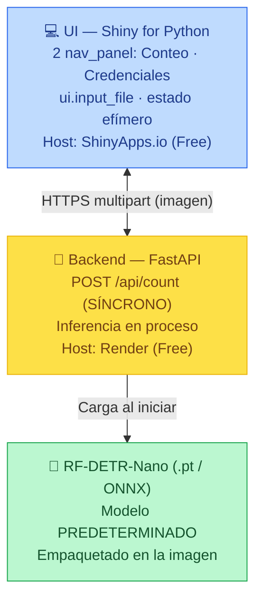
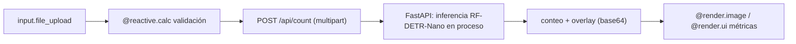

# Documento de Definición Técnica — AgroVisión MVP (Conteo por Dron)

> **Propósito del documento:** Definir el alcance mínimo viable (MVP) de AgroVisión, centrado en el flujo de **carga de ortomosaico + conteo de plantas con modelo predeterminado**, más una pestaña de **credenciales efímeras**. Es la primera entrega del proyecto y la base sobre la que se construye la [plataforma completa](description_proyecto_agrovision.md).
>
> **Stack MVP:** UI en **Shiny for Python**, inferencia **síncrona** con un modelo predeterminado **agnóstico** (multi-candidato YOLO26/RF-DETR, definido en el repo del modelo), **sin base de datos obligatoria** (modo efímero). Despliegue gratuito en un solo servicio.
>
> **Standby:** el módulo de conteo **arranca en _standby_** (`COUNTING_ENABLED=false`) hasta que el [repo del modelo](description_proyecto_modelo_conteo_plantas.md) publique `agrovision-plantcount` en Hugging Face Hub. Licencia: AgroVisión **open-source AGPL-3.0** (permite YOLO26).
>
> **Documentos relacionados:**
> - Plataforma completa (objetivo final): [`description_proyecto_agrovision.md`](description_proyecto_agrovision.md)
> - Repo del modelo de conteo (produce los pesos): [`description_proyecto_modelo_conteo_plantas.md`](description_proyecto_modelo_conteo_plantas.md)

---

## 0. Resumen Ejecutivo

El MVP de AgroVisión valida el **núcleo de valor** de la plataforma con la mínima complejidad: el usuario sube un ortomosaico RGB de dron y obtiene, en segundos, el **conteo de plantas, la densidad estimada y un overlay con las detecciones**, usando un modelo de visión **predeterminado** (entrenado en un repo aparte). No requiere base de datos, ni cuentas externas para la función principal.

*   **Propósito:** Demostrar el conteo automatizado de plantas de extremo a extremo, desplegable en capa gratuita, antes de incorporar teledetección y agente conversacional.
*   **Usuarios Objetivos:** Agrónomos y productores que necesitan estimar densidad/emergencia de un lote.
*   **Casos de Uso Core:**
    1.  El usuario **sube un ortomosaico RGB** del dron (`ui.input_file`).
    2.  El sistema ejecuta el **modelo de conteo predeterminado** (agnóstico: YOLO26/RF-DETR) y devuelve conteo, densidad (pl/Ha), malezas y % de fallas, con el overlay de *bounding boxes*.
    3.  El usuario revisa una pestaña de **Credenciales & APIs**: presente como base para módulos futuros (satélite, RAG), con el aviso de que **nada se guarda y que refrescar borra todo**.

> **Alcance excluido del MVP (roadmap):** teledetección Sentinel-2/NDVI, agente RAG (Groq), persistencia en Supabase, procesamiento asíncrono con PGMQ. Todo esto entra en la [plataforma completa](description_proyecto_agrovision.md).

---

## 1. Arquitectura de Componentes

El MVP usa una topología **simplificada**: una UI Shiny y un backend FastAPI con inferencia **síncrona** (sin worker ni cola). El modelo va empaquetado en la imagen del backend.



### 1.1 Glosario de Módulos

| Componente | Responsabilidad | Tecnologías | Despliegue |
| :--- | :--- | :--- | :--- |
| **UI (Shiny)** | Carga de imagen, disparo del conteo, render de métricas y overlay. Estado **efímero** en memoria. | Shiny for Python, `httpx`, Pillow | ShinyApps.io Free |
| **Backend (FastAPI)** | Recibe la imagen, ejecuta inferencia **síncrona**, devuelve conteo + overlay (imagen anotada en base64 o multipart). | FastAPI, **adaptador de inferencia** (onnxruntime o `ultralytics` según arquitectura), OpenCV | Render Free |
| **Modelo predeterminado** | Pesos de **solo inferencia**, cargados vía adaptador (**agnóstico**: YOLO26/RF-DETR). | `agrovision-plantcount` (ONNX) | Artefacto del repo del modelo (Hugging Face Hub); AGPL-3.0 aceptada |

> **Alternativa monolítica:** para el MVP es válido empaquetar UI + inferencia en un **único contenedor** (Shiny llamando al modelo en proceso) y desplegarlo en un solo host Docker (p. ej. Render o Hugging Face Spaces). La versión de dos servicios se prefiere si se quiere reutilizar el backend en la plataforma completa.

---

## 2. Flujo de Datos

### 2.1 Orígenes y Destinos

*   **Entradas:** ortomosaico RGB (`ui.input_file`); opcionalmente parámetros de vuelo (altura, GSD) para convertir conteo a densidad; área del lote (Ha) ingresada manualmente.
*   **Salidas:** conteo total, densidad pl/Ha, # malezas, % fallas, imagen con *bounding boxes*. **Nada se persiste**: todo vive en la sesión y se descarta al refrescar.

### 2.2 Grafo Reactivo (síncrono)



---

## 3. Modelo de Datos

**El MVP no requiere base de datos.** Toda la información de una corrida (imagen, conteo, métricas) vive en `reactive.value` de la sesión Shiny y se descarta al cerrar/refrescar.

> **Persistencia opcional (futuro):** si el usuario configura su propio Supabase, se reutilizaría la tabla `plant_counts` definida en la [plataforma completa](description_proyecto_agrovision.md#3-modelo-de-datos-bases-de-datos). En el MVP queda fuera de alcance.

---

## 4. Contratos de API

| Método | Path | Descripción | Entrada | Respuesta |
| :--- | :--- | :--- | :--- | :--- |
| `GET`  | `/api/status` | Healthcheck + versión del modelo. | — | `{"status":"ok","model":"agrovision-plantcount","version":"2.0.0"}` |
| `POST` | `/api/count` | Inferencia **síncrona** de conteo. | `multipart/form-data` (imagen) + `area_ha?` (form) | `{"count":124,"density":72400,"weeds":12,"failures":1.2,"confidence":0.91,"overlay_b64":"<png>"}` |

> **CORS:** `CORSMiddleware` con `allow_origins=[<ShinyApps.io>, "http://localhost:8000"]`. En el MVP la función principal (conteo) **no requiere llaves de usuario**, porque el modelo corre local; las cabeceras `X-User-*` se reservan para módulos futuros.

---

## 5. Lógica de Negocio

### 5.1 Conteo e Inferencia

El backend carga el modelo (ONNX) una sola vez al iniciar mediante un **adaptador de inferencia** — **agnóstico** a la arquitectura (onnxruntime, o `ultralytics` si el ganador es YOLO). Por cada imagen ejecuta detección (YOLO26/RF-DETR son **NMS-free**), cuenta cajas por clase (planta/arbusto, maleza), y para ortomosaicos grandes aplica *tiling* para respetar la RAM de Render (512 MB). **Mientras el módulo esté en standby**, este flujo está deshabilitado.

### 5.2 Densidad y GSD

$$Densidad_{pl/Ha} = \frac{Conteo_{plantas}}{Área_{Ha}}$$

El área puede ingresarse manualmente o derivarse del GSD y la cobertura de la imagen:

$$GSD = \frac{S_w \times H}{f \times I_w}$$

donde $S_w$ = ancho de sensor (mm), $H$ = altura de vuelo (m), $f$ = focal (mm), $I_w$ = ancho de imagen (px).

### 5.3 Reglas de Validación

1.  **Formato/tamaño:** solo `JPG/PNG/TIFF`; límite de tamaño en `ui.input_file` (p. ej. ≤ 50 MB) para no agotar RAM.
2.  **Confianza mínima:** detecciones bajo umbral (p. ej. `conf < 0.25`) se descartan.
3.  **Fallas de siembra:** se estiman como huecos en hileras detectadas (heurística sobre el patrón de cajas).

---

## 6. Interfaz de Usuario (UI/UX)

UI con **2 pestañas** (`ui.page_navbar`):

1.  **Detección Dron (Conteo)** — **arranca en _standby_** (aviso "Módulo en preparación") hasta `COUNTING_ENABLED=true`. Activo: zona de carga (`ui.input_file`), botón "Iniciar Conteo", visualizador del overlay con *bounding boxes*, panel de métricas (total, densidad, malezas, fallas, confianza). El modelo es **predeterminado** y **agnóstico** (YOLO26/RF-DETR), creado en el repo aparte; cultivo inicial: arándano.
2.  **Credenciales & APIs** — formularios (deshabilitados/placeholder para satélite y RAG en el MVP) con el aviso de efimeralidad.

### 6.1 Layout (Wireframe ASCII)

```text
┌──────────────────────────────────────────────────────────────────────┐
│ 🌱 AgroVisión MVP                                        [👤 Agrónomo] │
├──────────────┬───────────────────────────────────────────────────────┤
│ ▸ Dron YOLO  │  [📁 Subir ortomosaico]   [▶ Iniciar Conteo]           │
│ ▸ Credenciales│  ┌───────────────────────┐  ┌─ Métricas ───────────┐  │
│              │  │  Overlay con           │  │ Total: 124           │  │
│              │  │  bounding boxes        │  │ Densidad: 72,400 /Ha │  │
│              │  │  (Signed/base64)       │  │ Malezas: 12          │  │
│              │  └───────────────────────┘  │ Fallas: 1.2%         │  │
│              │                             └──────────────────────┘  │
└──────────────┴───────────────────────────────────────────────────────┘
```

### 6.2 Efimeralidad (idéntica a la plataforma completa)

*   Estado en `reactive.value` (memoria de sesión). Sin `localStorage`, sin cookies persistentes.
*   **Refrescar la página = nueva sesión = todo borrado.** La pestaña de Credenciales lo advierte:
    > ⚠️ *Tus credenciales y resultados se usan solo durante esta sesión. **No se guardan ni almacenan.** Si actualizas o cierras la página, todo se borrará.*

---

## 7. Configuración de Entornos y Despliegue

### 7.1 Variables de Entorno (`.env.example`)

```bash
APP_ENV=development
LOG_LEVEL=info

# UI (Shiny)
SHINY_PORT=8001
API_BASE_URL=http://localhost:8000   # En prod: URL del backend en Render

# Backend (FastAPI)
API_PORT=8000
ALLOWED_ORIGINS=http://localhost:8001,https://<tu-app>.shinyapps.io

# Modelo predeterminado (descargado de Hugging Face Hub en el build)
MODEL_PATH=/app/models/agrovision-plantcount-v2.0.0.onnx
MODEL_VERSION=2.0.0
HF_MODEL_REPO=<org>/agrovision-plantcount
COUNTING_ENABLED=false   # standby hasta que el modelo esté publicado
```

### 7.2 Docker (Local)

```yaml
# docker-compose.yml (MVP)
services:
  api:
    build: ./backend
    ports: ["8000:8000"]
    env_file: .env
    volumes: ["./models:/models:ro", "./sample_data:/data:ro"]
  ui:
    build: ./frontend
    ports: ["8001:8001"]
    environment: ["API_BASE_URL=http://api:8000"]
```

> Incluye `sample_data/` con ortomosaicos de ejemplo para probar el conteo sin credenciales. El modelo se monta read-only desde `models/`.

### 7.3 Producción (Capa Gratuita)

| Componente | Plataforma | Límites | Caveat |
| :--- | :--- | :--- | :--- |
| **UI (Shiny)** | [ShinyApps.io Free](https://support.posit.co/hc/en-us/articles/217592947-What-are-the-limits-of-the-shinyapps-io-Free-plan) | 5 apps · 25 h activas/mes | App ASGI nativa; `rsconnect deploy shiny`. |
| **Backend** | [Render Free](https://render.com/docs/free) | 512 MB · duerme a 15 min · 750 h/mes | *Cold start* 30–60 s; RF-DETR-Nano (ONNX ligero) cabe holgado. |

```powershell
# UI -> ShinyApps.io
uv run rsconnect deploy shiny ./frontend --name <cuenta> --title AgroVision-MVP

# Backend -> Render (Dockerfile detectado automáticamente)
```

> **Opción aún más simple:** desplegar el MVP como **monolito** (Shiny + inferencia en proceso) en un único contenedor Docker (Render o Hugging Face Spaces), evitando CORS y dos servicios.

### 7.4 Modelo Predeterminado

El MVP **no entrena**. Consume `agrovision-plantcount-v2.0.0.onnx` (arquitectura según el repo del modelo: YOLO26/RF-DETR) producido por el [repo del modelo](description_proyecto_modelo_conteo_plantas.md) y **publicado en Hugging Face Hub**; se descarga con `hf_hub_download` en el build y se carga vía el adaptador de inferencia. Contrato de inferencia: entrada = tile RGB; salida = `{"boxes":[[x1,y1,x2,y2,conf,cls]], "count":int}`.

---

## 8. Camino del MVP a la Plataforma Completa

| Capacidad | MVP | Plataforma completa |
| :--- | :--- | :--- |
| Conteo por dron (modelo predeterminado, agnóstico) | ✅ | ✅ |
| Credenciales efímeras (BYOK) | ✅ (placeholder) | ✅ (activas) |
| Inferencia | Síncrona en proceso | Asíncrona (PGMQ + worker) |
| Teledetección Sentinel-2 / NDVI | ❌ | ✅ |
| Agente RAG (Groq/Llama 3) | ❌ | ✅ |
| Persistencia (Supabase PostGIS + Storage) | ❌ | ✅ |
| Módulos UI | 2 | 5 |

El MVP comparte la misma base de código de UI y backend; activar los módulos restantes es incremental.

---

## Apéndice — Fuentes

Basado en [`Plan Detallado Data Science Agrícola.md`](../investigation/Plan%20Detallado%20Data%20Science%20Agr%C3%ADcola.md) y el [mockup](../investigation/agrovisi_n_spa_prototype.html). Límites de capa gratuita verificados: [ShinyApps.io](https://support.posit.co/hc/en-us/articles/217592947-What-are-the-limits-of-the-shinyapps-io-Free-plan), [Render](https://render.com/docs/free).
