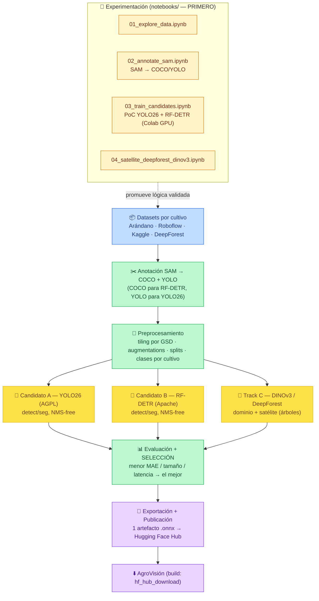

# Documento de Definición Técnica — Modelo de Conteo de Plantas (Repo Separado)

> **Propósito del documento:** Definir el repositorio **independiente** cuyo único objetivo es **crear, entrenar, evaluar y exportar el modelo de visión** que cuenta plantas a partir de imágenes RGB de **dron** (y árboles/copas desde **satélite de alta resolución**). Produce y publica **UN solo artefacto** (el mejor candidato) que consume AgroVisión; no expone una app productiva.
>
> **Enfoque multi-candidato (se publica el mejor):** se entrenan/evalúan **YOLO26** (Ultralytics, **AGPL-3.0**, NMS-free, detect/seg), **RF-DETR** (Roboflow, **Apache 2.0**, NMS-free, detect/seg) y **DINOv3** (backbone SSL + satelital); gana el de **menor MAE de conteo** que cumpla tamaño/latencia, y **solo ese se publica**. **DeepForest** (MIT) es baseline para árboles en satélite. Anotación con **SAM**.
>
> **Licencia:** AgroVisión **acepta AGPL-3.0** (la app es open-source), por lo que **YOLO26 es usable**. La licencia efectiva del artefacto publicado depende del candidato ganador (AGPL si YOLO26; Apache si RF-DETR) y se declara en la *model card*.
>
> **Multi-cultivo (arándano primero):** el modelo es **multi-clase/multi-cultivo**. Foco inicial: **arándano** (arbustos en hilera — relevante para Hortifrut). Se generaliza a otros cultivos cambiando **dataset + lista de clases**.
>
> **Publicación:** **1 artefacto** `agrovision-plantcount-vX.Y.Z.onnx` en **Hugging Face Hub**; AgroVisión lo descarga en su **build de Docker** (`hf_hub_download`) y lo consume por **contrato** (nombre de marca **desacoplado de la arquitectura**). Enfoque **notebooks-first**.
>
> **Documentos relacionados:** [`description_proyecto_agrovision.md`](description_proyecto_agrovision.md) · [`architecture_modelo_conteo_plantas.md`](../architect/architecture_modelo_conteo_plantas.md) · [`plan_modelo_conteo_plantas.md`](../plan/plan_modelo_conteo_plantas.md) · [`tareas_modelo_conteo_plantas.md`](../task/tareas_modelo_conteo_plantas.md) · [`Plan Detallado`](../investigation/Plan%20Detallado%20Data%20Science%20Agr%C3%ADcola.md)

---

## 0. Resumen Ejecutivo

Este repositorio implementa el **pipeline de Machine Learning** para el conteo automatizado de plantas, con **dos modalidades**:

1.  **Dron RGB (primaria):** conteo de plantas/arbustos individuales en ortomosaicos de baja altitud (~15–30 m) con un **detector** (candidatos: YOLO26 / RF-DETR). Cultivo inicial: **arándano**.
2.  **Satélite de alta resolución (secundaria):** conteo de árboles/copas en imágenes sub-métricas (MAXAR/Planet) con **DeepForest** y/o **DINOv3 satelital**.

> ⚠️ **Resolución:** el conteo individual requiere alta resolución (dron, o satélite sub-métrico). El **Sentinel-2 gratuito (10 m) NO sirve** para contar plantas; solo índices/área (eso vive en la teledetección de AgroVisión).

*   **Propósito:** Producir y **publicar el mejor modelo** de conteo (multi-candidato, multi-cultivo) como artefacto **predeterminado de solo inferencia** para AgroVisión.
*   **Estrategia "1 modelo, el mejor":** se entrenan varios candidatos (YOLO26, RF-DETR; opc. variantes seg) y `evaluate.py` **selecciona el de menor MAE de conteo** que cumpla tamaño/latencia en CPU; **solo ese se publica**. El satélite reusa pesos de **DeepForest** (no es artefacto propio).
*   **Multi-cultivo:** clases configurables; **arándano** primero, luego maíz/girasol/etc. (ver §2.3).
*   **Metodología notebooks-first:** (1) experimentar en notebooks; (2) endurecer en `.py`; (3) entrenar/evaluar/seleccionar/exportar/publicar.
*   **Entregable principal:** `agrovision-plantcount-vX.Y.Z.onnx` en **Hugging Face Hub** + *model card* (con arquitectura, licencia, cultivo, métricas) + contrato.

> **Frontera de responsabilidad:** este repo **entrena y publica**; AgroVisión **solo infiere** (agnóstico a la arquitectura, por contrato). YOLO26 y RF-DETR son **NMS-free**, así que el contrato no requiere NMS.

---

## 1. Arquitectura del Pipeline (Modular, Notebooks-First)



### 1.1 Glosario de Etapas

| Etapa | Responsabilidad | Tecnologías | Salida |
| :--- | :--- | :--- | :--- |
| **Experimentación (notebooks)** | Validar viabilidad por cultivo. | Jupyter, Colab/Kaggle (GPU T4) | Notebooks + hallazgos |
| **Ingesta** | Descargar/versionar datasets por cultivo. | `roboflow`, `kagglehub`, `deepforest`, DVC (opc.) | `data/raw/<cultivo>/` |
| **Anotación** | Etiquetado semi-automático. | **SAM**, OpenCV | **COCO** (RF-DETR) + **YOLO** (YOLO26) |
| **Preprocesamiento** | Tiling por GSD, augmentations, splits, clases. | `albumentations`, `supervision` | `data/processed/<cultivo>/` |
| **Entrenamiento (candidatos)** | *Fine-tuning* de YOLO26 y RF-DETR. | **`ultralytics`** (YOLO26), **`rfdetr`** | checkpoints por candidato |
| **Evaluación + selección** | Métricas + elegir el mejor. | supervision, scikit-learn | candidato ganador |
| **Exportación / publicación** | ONNX + model card + **HF Hub**. | `onnx`, `huggingface_hub` | `agrovision-plantcount-*.onnx` |

---

## 2. Flujo de Datos e Integración

### 2.1 Orígenes y Destinos
*   **Entradas:** datasets aéreos/satelitales por cultivo (RGB), parámetros de captura (GSD), anotaciones SAM.
*   **Salidas:** dataset anotado (COCO + YOLO), checkpoints por candidato, **1** `.onnx` publicado, métricas y *model card*.

### 2.2 Dónde Conseguir las Imágenes (sin dataset propio)

| Fuente | Cultivo/Modalidad | Acceso |
| :--- | :--- | :--- |
| **Roboflow Universe** (aerial/agriculture) | Multi-cultivo, export **COCO y YOLO** | [universe.roboflow.com](https://universe.roboflow.com/browse/aerial/agriculture) |
| **Arándano — estudios con dron** | *Bush Model* + *Berry Model* (YOLO); BerryNet | [arXiv 2501.02344](https://arxiv.org/abs/2501.02344) |
| **Kaggle** | Plant Detection & Counting (maíz/girasol), Plantations | `kagglehub` |
| **CitDet** | Cítricos (frutos) | [arXiv 2309.05645](https://arxiv.org/html/2309.05645v3) |
| **DeepForest / NEON** | Árboles (aéreo/satélite, MIT) | [github.com/weecology/DeepForest](https://github.com/weecology/DeepForest) |
| **MAXAR Open Data / Planet NICFI** | Satélite sub-métrico (árboles) | Programas gratuitos |
| **Sentinel-2 / Copernicus** | ⚠️ Solo índices/área (no conteo) | API STAC |

> **Datos propios de Hortifrut:** cuando existan ortomosaicos de campos de arándano, se anotan con SAM y se integran como dataset prioritario.

### 2.3 Cultivos Objetivo (multi-cultivo configurable)

El modelo es **multi-clase**; cada cultivo es un dataset + `data.yaml`/`categories` propio. Cultivos validados en la literatura para conteo con dron:

| Grupo | Cultivos | Paradigma |
| :--- | :--- | :--- |
| **Berries (foco Hortifrut)** | **Arándano** (arbustos; opc. bayas/yield), frambuesa, mora, fresa | Detección (arbusto) / densidad (bayas) |
| **Hilera / plántulas** | Maíz, girasol, remolacha, sorgo, algodón, soya, trigo, arroz, frijol, papa | Detección (stand count) |
| **Frutales / árboles** | Cítricos, palma, vid (racimos) | Detección / DeepForest |
| **Genérico denso** | Escenas muy densas (bayas, espigas) | Densidad (tipo TasselNetV4) |

> **Orden recomendado:** (1) **arándano** (detección de arbustos en hilera, MVP del modelo); (2) generalizar a maíz/girasol; (3) opcional: track de **densidad** para conteo de bayas/yield.

### 2.4 GSD

$$GSD = \frac{S_w \times H}{f \times I_w}$$

$S_w$ ancho de sensor (mm), $H$ altura (m), $f$ focal (mm), $I_w$ ancho de imagen (px). El GSD guía el **tamaño de *tile*** (cada planta/arbusto con suficientes píxeles). En arándano, la altura de vuelo se ajusta para que cada arbusto sea claramente resoluble.

---

## 3. Anotación Acelerada (SAM → COCO + YOLO)

**SAM (Segment Anything)** genera máscaras/cajas desde clics o cajas. Se exporta a **ambos formatos**: **COCO** (`_annotations.coco.json`, para RF-DETR) y **YOLO** (`.txt`, para YOLO26). Roboflow puede exportar a los dos. **DINOv3** ayuda con *pre-clustering* (features densas) en cultivos de geometría repetitiva (hileras de arándano).

> **Salida:** dataset anotado por cultivo, en COCO y YOLO, listo para entrenar cualquier candidato.

---

## 4. Candidatos de Modelo (se publica el mejor)

### 4.1 Candidato A — YOLO26 (Ultralytics, AGPL-3.0)

**YOLO26** (ene 2026): NMS-free end-to-end, unifica detect/seg/pose, **~43 % más rápido en CPU**, export ONNX. Variante **nano** (`yolo26n`) para CPU. **Habilitado** porque AgroVisión acepta **AGPL-3.0** (app open-source). [Docs](https://docs.ultralytics.com/models/yolo26)

### 4.2 Candidato B — RF-DETR (Roboflow, Apache 2.0)

**RF-DETR** (ICLR 2026): Detection Transformer real-time, **NMS-free**, **Apache 2.0** (permisivo), variante **Nano** para CPU, detect + **RF-DETR-Seg**. Alternativa si se quisiera evitar AGPL en el futuro. [GitHub](https://github.com/roboflow/rf-detr)

### 4.3 Track C — DINOv3 (dominio + satélite)

**DINOv3** (Meta, comercial-permisiva): backbone congelado SOTA sin fine-tuning + **backbone satelital MAXAR**. Robustez de dominio/estación y conteo de árboles/copa en satélite. [GitHub](https://github.com/facebookresearch/dinov3)

### 4.4 Baseline Satélite — DeepForest (MIT)

**DeepForest**: conteo de copas en RGB aéreo, modelo NEON preentrenado. Baseline del track satelital; reusa pesos publicados. [GitHub](https://github.com/weecology/DeepForest)

### 4.5 Tabla Comparativa

| Atributo | YOLO26-nano (A) | RF-DETR-Nano (B) | DINOv3 (C) | DeepForest |
| :--- | :--- | :--- | :--- | :--- |
| **Licencia** | AGPL-3.0 | Apache 2.0 | Comercial-permisiva | MIT |
| **Tarea** | detect/seg | detect/seg | backbone SSL | detect copas |
| **Post-proceso** | NMS-free | NMS-free | cabezal | RetinaNet |
| **Formato datos** | YOLO | COCO | — | — |
| **CPU/ONNX** | ✅ | ✅ | GPU | CPU/GPU |
| **Rol** | **Candidato (gana si menor MAE)** | **Candidato** | Dominio/satélite | Baseline satélite |

> **Criterio de selección:** se entrena cada candidato sobre el cultivo objetivo; gana el de **menor MAE de conteo** cumpliendo tamaño/latencia en CPU. La *model card* declara el ganador, su `architecture` y su licencia.

---

## 5. Entrenamiento, Hiperparámetros y Selección

### 5.1 Estrategia (notebooks-first, multi-candidato, multi-cultivo)

1.  **PoC en notebooks** por cultivo (arándano primero): entrenar YOLO26 y RF-DETR cortos en Colab/Kaggle.
2.  **Promoción a `.py`** con config declarativa y semillas fijas.
3.  **Transfer learning** desde pesos COCO de cada candidato; *tiling* por GSD + augmentations.
4.  **Selección**: comparar candidatos por MAE/tamaño/latencia → publicar el mejor.

### 5.2 Configuración de Referencia

```yaml
# configs/train.yaml (referencia)
crop: blueberry                 # cultivo objetivo (multi-cultivo)
candidates: [yolo26n, rfdetr_nano]
classes: ["arbusto"]            # arándano: 1 clase (arbusto). Multi-clase si aplica
imgsz: 640                      # YOLO26; RF-DETR usa múltiplos de 56 (p. ej. 560)
epochs: 100
seed: 42
```

### 5.3 Métricas y Selección
*   **Detección:** Precision, Recall, mAP@0.5, mAP@0.5-0.95, F1.
*   **Conteo (negocio):** **MAE/RMSE** entre conteo predicho y real → **criterio de selección**.
*   **Por cultivo:** métricas reportadas por cultivo en `metrics.json`.

---

## 6. Contrato de Inferencia y Publicación (Handoff a AgroVisión)

### 6.1 Exportación a ONNX (según el candidato ganador)

```bash
# YOLO26 (si gana)
uv run yolo detect export model=runs/.../best.pt format=onnx opset=12 simplify=True
# RF-DETR (si gana)
uv pip install "rfdetr[onnx]" && python -c "from rfdetr import RFDETRNano; RFDETRNano(pretrain_weights='output/checkpoint_best.pth').export(format='onnx')"
# renombrar a marca: agrovision-plantcount-vX.Y.Z.onnx
```

### 6.2 Publicación en Hugging Face Hub (1 artefacto)

```python
from huggingface_hub import HfApi
HfApi().upload_file(path_or_fileobj="models/agrovision-plantcount-v2.0.0.onnx",
    path_in_repo="agrovision-plantcount-v2.0.0.onnx",
    repo_id="<org>/agrovision-plantcount", repo_type="model")
# + README.md (model card: arquitectura ganadora, licencia, cultivo, métricas)
```

### 6.3 Contrato de Inferencia (estable, agnóstico a la arquitectura)

```json
{
  "boxes": [[x1, y1, x2, y2, conf, cls]],
  "count": 124,
  "classes": {"0": "arbusto"},
  "crop": "blueberry",
  "model_version": "2.0.0",
  "architecture": "yolo26n",     // o "rfdetr_nano" — el ganador
  "license": "AGPL-3.0",          // o "Apache-2.0"
  "nms_free": true
}
```

*   **Agnóstico:** AgroVisión lee `architecture` y aplica el **adaptador de decode** correspondiente; el nombre del artefacto es de marca (`agrovision-plantcount`), no cambia al cambiar de modelo.
*   **Multi-cultivo:** `crop` y `classes` describen el cultivo/clases del modelo publicado.

### 6.4 Consumo en AgroVisión (build de Docker)

```dockerfile
RUN uv run python -c "from huggingface_hub import hf_hub_download; \
  hf_hub_download(repo_id='<org>/agrovision-plantcount', \
  filename='agrovision-plantcount-v2.0.0.onnx', local_dir='/app/models')"
ENV MODEL_PATH=/app/models/agrovision-plantcount-v2.0.0.onnx
ENV MODEL_VERSION=2.0.0
```

---

## 7. Estructura del Repo, Docker y Reproducibilidad

```
agrovision-plant-count-model/
├── notebooks/   # 01_explore · 02_annotate_sam · 03_train_candidates · 04_satellite
├── src/
│   ├── ingest.py          # descarga por cultivo (COCO + YOLO)
│   ├── annotate_sam.py     # SAM → COCO + YOLO
│   ├── preprocess.py       # tiling/splits/augment + clases por cultivo
│   ├── train.py            # entrena candidatos (yolo26 / rfdetr)
│   ├── evaluate.py         # métricas + SELECCIÓN del mejor
│   ├── export.py           # ganador → ONNX + model card
│   ├── publish.py          # → Hugging Face Hub
│   └── satellite/          # deepforest_count.py · dinov3_features.py
├── configs/    # train.yaml (crop, candidates, classes)
├── data/       # raw/<cultivo>/ · processed/<cultivo>/ (NO commitear)
├── models/     # .onnx + metrics.json
├── tests/      # test_contract · test_preprocess · test_parity
├── Dockerfile · pyproject.toml · .gitignore · README.md
```

### 7.1 Dependencias
```toml
"ultralytics>=8.3",          # YOLO26 (AGPL — uso aceptado)
"rfdetr[onnx]>=1.4",         # RF-DETR (Apache 2.0)
"torch>=2.2", "torchvision>=0.17",
"onnx>=1.16", "onnxruntime>=1.18",
"opencv-python-headless>=4.9", "numpy>=2.1",
"albumentations>=1.4", "supervision>=0.20",
"segment-anything-2",        # SAM (anotación)
"deepforest>=1.4",           # baseline árboles (MIT)
"kagglehub", "roboflow",     # ingesta (COCO + YOLO)
"huggingface_hub",           # publicación
# DINOv3 vía torch.hub / facebookresearch/dinov3
```
> **Python ≥ 3.10** (requisito de `rfdetr`) y **`uv`**. Entrenamiento en Colab/Kaggle (GPU T4 gratis); CPU local para preproceso/validación.

---

## 8. Reglas de Validación y Pruebas
1.  **Contrato:** `tests/test_contract.py` valida el JSON §6.3 (incl. `architecture`, `crop`, `license`, `nms_free`).
2.  **Sanity de conteo:** MAE bajo umbral por cultivo.
3.  **Determinismo:** seeds fijas → reproducible.
4.  **Selección:** se documenta el candidato ganador y por qué.
5.  **Paridad notebook↔script** y **publicación** descargable de HF Hub.

---

## Apéndice — Fuentes

YOLO26 ([Ultralytics](https://docs.ultralytics.com/models/yolo26)); RF-DETR ([GitHub](https://github.com/roboflow/rf-detr)); DINOv3 ([Meta](https://ai.meta.com/blog/dinov3-self-supervised-vision-model/)); DeepForest ([GitHub](https://github.com/weecology/DeepForest)); **arándano con dron** ([arXiv 2501.02344](https://arxiv.org/abs/2501.02344)); cultivos UAV ([bioRxiv 2021](https://www.biorxiv.org/content/10.1101/2021.04.27.441631v2.full)); CitDet ([arXiv 2309.05645](https://arxiv.org/html/2309.05645v3)); TasselNetV4 ([arXiv 2509.20857](https://arxiv.org/pdf/2509.20857)); Hugging Face Hub ([docs](https://huggingface.co/docs/hub/en/models-downloading)).
